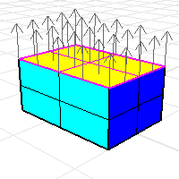
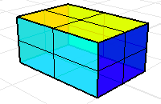
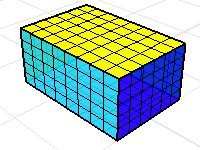
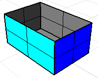
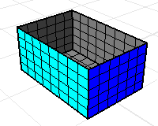
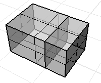
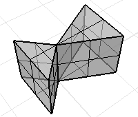
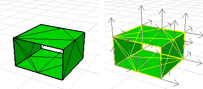

---
---

{: #kanchor2976}{: #kanchor2977}{: #kanchor2978}{: #kanchor2979}{: #kanchor2980}{: #kanchor2981}
# Volume mass properties
The objects selected as part of the volume command must bound a volume. The simplest way to ensure this is to select solid objects (closed, manifold, and oriented with their normal direction pointing outward). However, there are cases where it is inconvenient to join objects into such a polysurface or mesh.
In these cases, volume mass properties can be computed from a collection of non-solid objects.
You are responsible for ensuring that:
The objects enclose a volume.Each surface is on the boundary of the volume, not in its interior.The surface or mesh normal points outward away from the volume.Steps
Use the [Dir](dir.html) command to check or modify the surface or mesh normal.Six rectangular surfaces or mesh faces with the correct orientation define the volume of the box.Without the top of the box the volume mass properties commands will return a meaningless result.
# Volume mass properties of non-manifold objects
A polysurface or mesh for which every edge is shared by at most two faces is called amanifold. The volume mass property commands assume that every face bounds the volume.
A non-manifold polysurface where every surface does not bound a volume. The volume mass properties commands will give a meaningless answer.

A non-manifold polysurface where every surface bounds a volume. The volume mass properties commands will return valid data.

# Volume mass properties of non-oriented objects
A polysurfaces or a mesh may have inconsistent orientations on the faces.
Use the [Dir](dir.html) command to display the face normals. A properly oriented solid will have outward pointing normals.
This mesh has inconsistent normals.

To change normals on some faces of a polysurface
Use the [Explode](explode.html) command or the [ExtractSrf](extractsrf.html) command to isolate the offending faces.Use the [Dir](dir.html) command on individual faces to properly orient the normals.Use the [Join](join.html) command to reconstruct the polysurface.To change normals on non-oriented meshes
Use the [UnifyMeshNormals](unifymeshnormals.html) command.The fixed mesh with consistent, outward pointing normals.
# Mass properties calculation details
Different disciplines and textbooks use different, and sometimes contradictory, nomenclature and notation when defining various moments. The information in the area or volume moments report can be used to compute any of these moments. In order to get the particular moment you need, you may have to combine several of the values from the moments report.
Example
The area moments report for a constant *z* plane with corners at 0,0,0 and 6,10,0 is shown below.
Area = 60 (+/- 1e-008)
Area Centroid = 3,5,0 (+/- 1e-009,1e-009,0)
Area Moments:
First Momentsx: 180 (+/- 1e-007)y: 300 (+/- 1e-007)z: 0 (+/- 0)
Second Momentsxx: 720 (+/- 1e-007)yy: 2000 (+/- 1e-006)zz: 0 (+/- 0)
Product Momentsxy: 900 (+/- 1e-007)yz: 0 (+/- 0)zx: 0 (+/- 0)
Area Moments of Inertia about World Coordinate AxesIx: 2000 (+/- 1e-006)Iy: 720 (+/- 1e-007)Iz: 2720 (+/- 1e-006)
Area Radii of Gyration about World Coordinate AxesRx: 5.77350269 (+/- 1e-009)Ry: 3.46410162 (+/- 1e-009)Rz: 6.73300329 (+/- 1e-009)
Area Moments of Inertia about Centroid Coordinate AxesIx: 500 (+/- 1e-007)Iy: 180 (+/- 1e-007)Iz: 680 (+/- 1e-007)
Area Radii of Gyration about Centroid Coordinate AxesRx: 2.88675135 (+/- 1e-009)Ry: 1.73205081 (+/- 1e-009)Rz: 3.36650165 (+/- 1e-009)
The numbers shown in parenthesis report the accuracy of the computation.
Precise descriptions of the values in the area and volume moments report are given below.
First moments
The area first moments have units of length3. The volume first moments have units of length4. When discussing area moments in the xy plane, some disciplines and textbooks use the symbol Mx, to denote the value reported as "First Moments y:" while other disciplines and textbooks use the same symbol to denote the value reported as "First Moments x:". A similar confusing situation involves the symbol My.
In terms of integrals, the area first moments are defined by:
Area first moment x: value = integral ofx dAover the area,
Area first moment y: value = integral ofy dAover the area,
Area first moment z: value = integral ofz dAover the area.
Similarly, the volume first moments are defined by:
Volume first moment x: value = integral ofx dVover the volume,
Volume first moment y: value = integral ofy dVover the volume,
Volume first moment z: value = integral ofz dVover the volume.
For either an area or a volume, the relationship between the first moments, the area or volume, and the area centroid is:
Centroid x coordinate = (first moment x: value)/M,
Centroid y coordinate = (first moment y: value)/M,
Centroid z coordinate = (first moment z: value)/M,
where *M* is the area or volume.
Second moments
The area second moments have units of length4. The volume second moments have units of length5.
In terms of integrals, the area second moments are defined by:
Area second moment xx: value = integral ofx2dAover the area,
Area second moment yy: value = integral ofy2dAover the area,
Area second moment zz: value = integral ofz2dAover the area.
Similarly, volume second moments are defined by:
Volume second moment xx: value = integral ofx *2* dVover the volume,
Volume second moment yy: value = integral ofy *2* dVover the volume,
Volume second moment zz: value = integral ofz *2* dVover the volume.
Product moments
The area product moments have units of length4. The volume product moments have units of length5.
In terms of integrals, the area product moments are defined by:
Area product moment xy: value = integral ofxy dAover the area,
Area product moment yz: value = integral ofyz dAover the area,
Area product moment zx: value = integral ofzx dAover the area.
Similarly, volume product moments are defined by:
Volume product moment xy: value = integral ofxy dVover the volume,
Volume product moment yz: value = integral ofyz dVover the volume,
Volume product moment zx: value = integral ofzx dVover the volume.
For either an area or a volume, products of inertia are useful for computing moments of inertia about axes that are not parallel to a coordinate axis. In particular, an area moment of inertia about any axis can be expressed as a linear combination of the area, area first moments, area second moments, and area product moments.
Moments of inertia about world-coordinate axes
The area moments of inertia have units of length4. The volume moments of inertia have units of length5. It is fairly standard to use the symbols *Ix*, *Iy*, and *Iz* to denote the area moments of inertia about the world *x&#160;axis*, *y&#160;axis*, and *z&#160;axis*, respectively.
In terms of integrals, the area moments of inertia about the world axes are defined by:
Ix= integral of (y2+ z2) dAover the area,
Iy *= integral of (z* 2 *+ x* 2 *) dA* over the area,
Iz *= integral of (x* 2 *+ y* 2 *) dA* over the area.
Volume moments of inertia are defined in a similar manner.
For either an area or a volume, the moments of inertia about the world axes are defined in terms of second moments by:
 *Ix* = second moment yy: value + second moment zz: value,
 *Iy* = second moment zz: value + second moment xx: value,
 *Iz* = second moment xx: value + second moment yy: value.
Radii of gyration about world-coordinate axes
The radii of gyration have units of length. Engineering references and textbooks frequently use *R* or *k* to denote radii of gyration. The area radius of gyration about a 3-D axis is defined to be the square root of (area moment of inertia about the axis)/area.
Similarly, the volume radius of gyration is defined as the square root of (volume moment of inertia about the axis)/volume.
For either an area or a volume, radii of gyration about the world axes in the area moments report are computed as:
 *Rx* = sqrt( Ix/ M ),
 *Ry* = sqrt( Iy/ M ),
 *Rz* = sqrt( Iz/ M ),
where *M* is the area or volume.
Here theI *x* ,I *y*, andI *z* are the area moments of inertia about the world axes.
Moments of inertia about centroid-coordinate axes
The area moments of inertia about the centroid have units of length4. The volume moments of inertia about the centroid have units of length5. It is also fairly standard to use the symbols *Ix*, *Iy*, and *Iz* to denote these area moments of inertia.
In terms of integrals, the area moments of inertia about the object's area centroid are defined by:
I *x* = integral of((y-y *0* ) *2* +( z-z *0* ) *2* ) dAover the area,
 *Iy= integral of ((z-z0)2* + *( x-x0)2) dA* over the area,
 *I* z= integral of *((x-x* 02+(y-y0)2 *) dA* over the area,
Here ( *x0* &gt;, *y0* ,z0) is the area centroid.
Volume moments of inertia about the volume centroid are defined in a similar manner.
The area (or volume) moments of inertia are expressed in terms second moments, first and volume):
 *Ix* = second moment yy: value
+ second moment zz: value
- 2* *y*  *0* *(first moment y: value)
- 2* *z*  *0* *(first moment z: value)
+ ( *y*  *0*  *2*  *+z*  *0*  *2* )* *M*,
 *Iy* = second moment zz: value
+ second moment xx: value
- 2* *z*  *0* *(first moment z: value)
- 2* *x*  *0* *(first moment x: value)
+ ( *z*  *0*  *2*  *+x*  *0*  *2* )* *M*,
 *Iz* = second moment xx: value
+ second moment yy: value
- 2* *x*  *0* *(first moment x: value)
- 2* *y*  *0* *(first moment y: value)
+ ( *x*  *0*  *2*  *+y*  *0*  *2* ) * *M*,
where *M* is the area or volume.
Radii of gyration about centroid-coordinate axes
The radii of gyration about the centroid have units of length. For an area or a volume, the radii of gyration about the centroid in the moments report are computed as:
 *Rx* = sqrt *( Ix / M )*,
 *Ry* = sqrt *( Iy / M ),* 
 *Rz* = sqrt *( Iz / M ),* 
where *M* is the area or volume.
Here the *Ix* ,Iy, andIzare the area (or volume) moments of inertia about the area or volume centroid.
&#160;
&#160;
Rhinoceros 6 © 2010-2015 Robert McNeel &amp; Associates.11-Nov-2015
 [Open topic with navigation](massproperties.html) 

