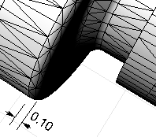

---
---

{: #kanchor1356}
# MatchMeshEdge
 [Where can I find this command?](javascript:void(0);) Toolbars
 [Mesh Tools](mesh-tools-toolbar.html) 
Menus
Mesh
Mesh Repair Tools
Match Mesh Edge
The MatchMeshEdge command moves face edges of an open mesh to meet adjacent face edges.
Note
First, the command will try to match vertices, then it will try to split edges to make the edges match.No part of the mesh is moved more than the specified tolerance.You can use this command either on the complete mesh or on selected edges.When selecting a whole mesh, using a high tolerance can create unexpected results. Use larger tolerances only if you select specific edges to close.Before edge matching, magenta edges are open.Steps
 [Select](select-objects.html) a mesh edge.Options
PickEdges
Select specific edges to match.
DistanceToAdjust
 [Specify](distance-pick-2pts.html) the tolerance distance.
RatchetMode
Matching the mesh takes place in four passes starting at a tolerance that is smaller than your specified tolerance and working up to the specified tolerance with successive passes. This matches small edges first and works up to larger edges.
Note
Some STL/SLA printers have problems if meshes contain many long, thin facets. These can slow the printer's slicing process down, produce odd printed results, and run the printer out of memory.The [MeshRepair](meshrepair.html) command may be useful when tuning up meshes for STL/SLA printing.See also
 [Edit mesh objects](sak-meshtools.html) 
&#160;
&#160;
Rhinoceros 6 © 2010-2015 Robert McNeel &amp; Associates.11-Nov-2015
 [Open topic with navigation](matchmeshedge.html) 

