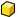
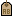
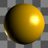
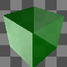
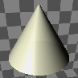
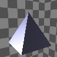
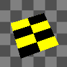
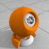
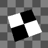

---
---

## Material window context menu
These settings also appear on right-click context menus for the thumbnail previews and the thumbnail background.
Assign to Selection
Assigns the current material to selected objects.
Assign to Layers of selected objects.
Assigns the current material to the layers of currently selected objects.
Assign to Layers
Assigns the current material to selected layers.
Select Object(s)
Select objects in the model for material assignment.
Save to File
Saves a material to a Rhino .rmtl file.
Reset to Defaults
Changes all of the material settings to the default white, matte, non-reflective, untextured material.
Delete
Deletes the selected material.
Tags
Tag materials to group or categorize materials to make searching easier.
Duplicate
Copies the selected material to a new material with the same settings.
Remove Instancing
Removes the connection between instanced materials.
Floating Preview
Floats the preview image in a resizable window.
Sphere
Cube
Cone
Pyramid
Torus
Plane
Material Scene
Show Labels
Displays thumbnail name labels when inGridmode.
Listmode always displays labels.
Show Units
Displays size in model units.
Auto-Update Preview
Automatically updates all previews as settings change.
Show Preview Pane
Displays the preview properties for the currently-selected thumbnail. Set the preview geometry, size, background, rotation behavior.
Properties
Opens thePreview Propertiesdialog box.
Preview thumbnail images and the background area between thumbnail images both have context menus.

### Preview Properties
The preview properties settings control the appearance of the thumbnail images.
Geometry
These settings specify the geometry of the object that will display the material in the preview thumbnail.
Sphere

Cube

Cone

Pyramid

Torus

Plane

Scene

Size
Sets the unit size for the preview thumbnail.
Background
Controls the appearance of the thumbnail background.
None
The default gray environment is used.

Checkered
A gray checkered backdrop is used.

Custom
Uses an environment as the background.

Click to assign
Click to assign a saved environment.In the Select Environment dialog box, select a saved environment.Option
 **New** 
Create a new environment.
{: #view}View
Controls the right-mouse drag object or camera rotation.
Rotate object
Right-mouse drag rotates the object.
Rotate camera
Right-mouse drag rotates the camera.
X angle
Sets the horizontal rotation angle for the object or camera.
Y angle
Sets the vertical rotation angle for the object or camera.
Lighting
Simple lighting
Uses the default lighting.
Skylighting
Uses the current [skylighting](rhino-render.html#skylight) settings.
 **Save as Defaults** 
Saves the thumbnail properties as the default settings.
 **Load from Defaults** 
Uses the default settings.
Close
Closes the large preview window.
 [Open topic with navigation](materialpanel-largepreviewmenu.html) 

