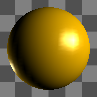
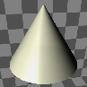

---
---

## Material Thumbnail context menu
Assign to Selection
Assigns the current material to selected objects.
Assign to Layers of selected objects.
Assigns the current material to the layers of currently selected objects.
Assign to Layers
Assigns the current material to selected layers.
Select Object(s)
Select objects in the model for material assignment.
Create New Material
Creates a new basic matte white (plaster) material.
Import Material from File
Imports materials from a saved Rhino .rmtl file.
Save to File
Saves a material to a Rhino .rmtl file.
Reset to Defaults
Changes all of the material settings to the default white, matte, non-reflective, untextured material.
Copy
Copies the selected material to the Clipboard. The Clipboard can then be pasted into the editor to create a new material or pasted directly into a folder to create a [library](libraries.html#libraries) file.
Paste
Creates a new material based on the contents of the Clipboard.
Paste as Instance
Creates a new material based on the contents of the Clipboard that is linked to the original through instancing.
Delete
Deletes the selected material.
Tags
Tag materials to group or categorize materials to make searching easier.
Duplicate
Copies the selected material to a new material with the same settings.
Remove Instancing
Removes the connection between instanced materials.
Floating Preview
Floats the preview image in a resizable window.
Grid
Displays the previews as a grid of thumbnails.
List
Displays the previews as a list of thumbnails.
Tree
Displays the previews as a tree showing nesting.
Horizontal Layout
Displays the previews to the left of the controls.
Show Preview Pane
Displays the preview properties for the currently-selected thumbnail. Set the preview geometry, size, background, rotation behavior.
Float
Floats the preview image in a re-sizable window.
Tiny
Sets the thumbnail size to the smallest size.
Small
Sets the thumbnail size to the smaller size.
Medium
Sets the thumbnail size to medium size.
Large
Sets the thumbnail size to large size.
Show Labels
Displays thumbnail name labels when inGridmode.
Listmode always displays labels.
Show Units(3-D only)
Displays size in model units.
Auto-Update Preview
Automatically updates all previews as settings change.
Update All Previews
Update previews manually whenAuto-Update Previewis off.
Properties
Opens thePreview Propertiesdialog box.

### Preview Properties
The preview properties settings control the appearance of the thumbnail images.
Geometry
These settings specify the geometry of the object that will display the material in the preview thumbnail.
Sphere

Cube

Cone

Pyramid

Torus

Plane

Scene

Size
Sets the unit size for the preview thumbnail.
Background
Controls the appearance of the thumbnail background.
None
The default gray environment is used.

Checkered
A gray checkered backdrop is used.

Custom
Uses an environment as the background.

Click to assign
Click to assign a saved environment.In the Select Environment dialog box, select a saved environment.Option
 **New** 
Create a new environment.
{: #view}View
Controls the right-mouse drag object or camera rotation.
Rotate object
Right-mouse drag rotates the object.
Rotate camera
Right-mouse drag rotates the camera.
X angle
Sets the horizontal rotation angle for the object or camera.
Y angle
Sets the vertical rotation angle for the object or camera.
Lighting
Simple lighting
Uses the default lighting.
Skylighting
Uses the current [skylighting](rhino-render.html#skylight) settings.
 **Save as Defaults** 
Saves the thumbnail properties as the default settings.
 **Load from Defaults** 
Uses the default settings.

### Preview Properties
The preview properties settings control the appearance of the thumbnail images.
Geometry
These settings specify the geometry of the object that will display the material in the preview thumbnail.
Sphere

Cube

Cone

Pyramid

Torus

Plane

Scene

Size
Sets the unit size for the preview thumbnail.
Background
Controls the appearance of the thumbnail background.
None
The default gray environment is used.

Checkered
A gray checkered backdrop is used.

Custom
Uses an environment as the background.

Click to assign
Click to assign a saved environment.In the Select Environment dialog box, select a saved environment.Option
 **New** 
Create a new environment.
{: #view}View
Controls the right-mouse drag object or camera rotation.
Rotate object
Right-mouse drag rotates the object.
Rotate camera
Right-mouse drag rotates the camera.
X angle
Sets the horizontal rotation angle for the object or camera.
Y angle
Sets the vertical rotation angle for the object or camera.
Lighting
Simple lighting
Uses the default lighting.
Skylighting
Uses the current [skylighting](rhino-render.html#skylight) settings.
 **Save as Defaults** 
Saves the thumbnail properties as the default settings.
 **Load from Defaults** 
Uses the default settings.
 [Open topic with navigation](materialthumbnail-contextmenu.html) 

