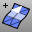
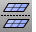

---
---

# Mesh Tools toolbar
{: #kanchor1446}
 [To open a toolbar](javascript:void(0);) Toolbars can be opened as a free-standing group or added to the current group.
To open a toolbar as a free-standing group
Click theOptionsicon in any toolbar group.On the menu, clickShow Toolbar, and then select the toolbar name from the list.To open a toolbar as a new tab in the current group
Click theOptionsicon in the toolbar group where you want to add the new tab.On the menu, clickShow or Hide Tabs, and then select the toolbar name from the list. [AlignMeshVertices](alignmeshvertices.html) 
Force mesh vertices to the same location.
 [ApplyMesh](applymesh.html) 
Fit a mesh that matches a source mesh onto a surface.
 [ApplyMeshUVN](applymeshuvn.html) 
Wrap meshes and points onto a surface.
 [Check](check.html) 
Report errors in an object's data structure.
 [CullDegenerateMeshFaces](culldegeneratemeshfaces.html) 
Delete zero-area mesh faces.
 [DeleteMeshFaces](deletemeshfaces.html) 
Remove mesh faces from a mesh creating a hole.
 [DupMeshHoleBoundary](dupmeshholeboundary.html) 
Create a polyline that duplicates the boundary of a mesh hole.
 [ExtractMeshFaces](extractmeshfaces-commands.html) 
Separate faces from a mesh.
Link to [Extract Mesh toolbar](extract-mesh-toolbar.html).
 [FillMeshHole](fillmeshhole.html) 
Fill a hole in a mesh.
 [FillMeshHoles](fillmeshholes.html) 
Fill all holes in a mesh.
 [MatchMeshEdge](matchmeshedge.html) 
Move naked mesh face edges to meet adjacent face edges.
 [Merge2MeshFaces](merge2meshfaces.html) 
Merge two triangular mesh faces into one quadrangular face.
 [Mesh](mesh.html) 
Create a mesh from a NURBS surface or polysurface.
 [MeshToNURB](meshtonurb.html) 
Duplicate each mesh face with a NURBS surface.
 [MeshBooleanUnion](meshbooleanunion.html) 
Combine the volumes of objects into a single mesh.
Link to [Mesh Booleans toolbar](mesh-booleans-toolbar.html).
{: #meshfrompoints}
 [MeshFromPoints](http://download.rhino3d.com/download.asp?id=meshfrompointsV5x64) 
Creates a mesh from selected point objects. TheMesh from Pointsplug-in must be installed. Click [here](http://download.rhino3d.com/download.asp?id=meshfrompointsV5x64) to install for 64-bit Rhino 5.
 [MeshIntersect](meshintersect.html) 
Create a polyline at the intersection of mesh objects.
 [MeshRepair](meshrepair.html) 
Open the Mesh Repair wizard.
 [MeshSplit](meshsplit.html) 
Divide meshes into parts with another object.
 [MeshTrim](meshtrim.html) 
Delete portions of a mesh inside or outside intersections with another object.
 [OffsetMesh](offsetmesh.html) 
Copy a mesh parallel to the original.
 [PatchSingleFace](patchsingleface.html) 
Fill a mesh hole with a single mesh face.
 [QuadrangulateMesh](quadrangulatemesh.html) 
Merge mesh triangles into quadrangles.
 [RebuildMesh](rebuildmesh.html) 
Strip texture coordinates, [vertex](meshvertex.html) colors, surface curvatures, and surface parameters from a mesh.
 [RebuildMeshNormals](rebuildmeshnormals.html) 
Remove mesh normals and reconstruct the face and [vertex](meshvertex.html) normals.
 [ReduceMesh](reducemesh.html) 
Reduce the number of mesh polygons and triangulates quadrangles.
 [TriangulateMesh](triangulatemesh.html) 
Split each quadrangular mesh face into two triangles.
 [SplitDisjointMesh](splitdisjointmesh.html) 
Divide into separate objects meshes that do not connect, but are still one object.
 [SplitMeshEdge](splitmeshedge.html) 
Divide a mesh edge.
 [SwapMeshEdge](swapmeshedge.html) 
Transpose the corners of mesh triangles.
 [TriangulateMesh](triangulatemesh.html) 
Split each quadrangular mesh face into two triangles.
 [TriangulateNonPlanarQuads](triangulatenonplanarquads.html) 
Split each non-planar quadrangular mesh face into two triangles.
 [UnifyMeshNormals](unifymeshnormals.html) 
Change the normal direction mesh faces so they all point in a consistent direction.
 [Flip](flip.html) 
Reverse the normal direction of a curve, surface, or mesh.
 [Weld](weld.html) 
Remove creases from a mesh by merging coincident mesh vertices.
Link to [Welding toolbar](welding-toolbar.html).
 [WeldVertices](weld.html#weldvertices) 
Remove creases from a mesh by merging all selected mesh vertices.
Link to [Collapse Mesh toolbar](collapse-mesh-toolbar.html).
&#160;
&#160;
Rhinoceros 6 © 2010-2015 Robert McNeel &amp; Associates.11-Nov-2015
 [Open topic with navigation](mesh-tools-toolbar.html) 

