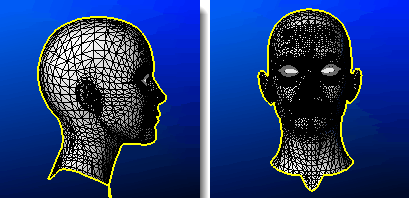

---
---

{: #kanchor1450}
# MeshOutline
 [Where can I find this command?](javascript:void(0);) Toolbars
 [Curve From Object](curve-from-object-toolbar.html) 
Menus
Curve
Curve From Objects
Mesh Outline
The MeshOutline command creates a polyline outline of the polygon mesh objects or the render mesh of selected surfaces or polysurfaces.

The outline direction is based on the current view.
Steps
 [Select](select-objects.html) a mesh, surface, or polysurface.See also
 [Silhouette](silhouette.html) 
Create outline curves from a surface or polysurface.
 [Create curves from other objects](sak-curvefromobject.html) 
&#160;
&#160;
Rhinoceros 6 © 2010-2015 Robert McNeel &amp; Associates.11-Nov-2015
 [Open topic with navigation](meshoutline.html) 

