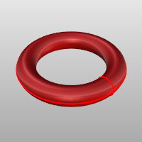

---
---

{: #kanchor1472}
# MeshTorus
 [Where can I find this command?](javascript:void(0);) Toolbars
 [Mesh Creation](mesh-creation-toolbar.html) 
Menus
Mesh
Polygon Mesh Primitives
Torus
The MeshTorus command draws a polygon mesh torus.
Steps
 [Pick](pick-location.html) the center and radius of the base circle.See the [Circle](circle.html) command for option descriptions.Pick the radius for the torus cross section.Your browser does not support the video tag.Face options
AroundFaces / VerticalFaces

AroundFaces (1)
The number of faces around the circumference.
VerticalFaces (2)
The number of faces from the base to the apex.
Second radius options
Diameter/Radius
Click the option to toggle between picking a Radius and picking a Diameter.
FixInnerDimension
The first radius chosen sets the inner dimension of the torus and the second radius is constrained to be outside of the first radius.
See also
 [Mesh](mesh.html) 
Create a mesh from a NURBS surface or polysurface.
 [Torus](torus.html) 
Draw a torus (donut shape).
&#160;
&#160;
Rhinoceros 6 © 2010-2015 Robert McNeel &amp; Associates.11-Nov-2015
 [Open topic with navigation](meshtorus.html) 

