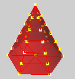

---
---

Mesh vertex
The location where the edges of the mesh faces meet. The mesh vertex (plural *vertices* ) contains x, y, and z&#160;coordinates and may contain a vector normal, a color value, and texture coordinates.

Mesh vertices selected.
 [Open topic with navigation](meshvertex.html) 

