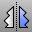

---
---

{: #kanchor1474}{: #kanchor1475}{: #kanchor1476}
# Mirror
 [Where can I find this command?](javascript:void(0);) Toolbars
 [Transform](transform-toolbar.html) 
Menus
Transform
Mirror
The Mirror command creates a mirror-image copy of objects.
Steps
 [Select](select-objects.html) the objects. [Pick](pick-location.html) the start of the mirror plane.Pick the end of the mirror plane.As you move the cursor, Rhino previews the location for the mirrored objects.The two end points specify a mirror plane perpendicular to the construction plane.Use [object snaps](object-snaps.html) to accurately place the mirror plane, especially if you want to [Join](join.html) a surface and its mirrored copy.Your browser does not support the video tag.Command-line options
{: #3point}3Point
Pick three points to define a mirror plane.Your browser does not support the video tag.Copy
 [&#160;History enabled](historyenabled.html) 
The Copy option specifies whether or not the objects are copied. A plus signappears at the cursor when copy mode is on.
The [RememberCopyOptions](remembercopyoptions.html) command determines whether the selected option is used as the default.
XAxis
Automatically mirrors the object around the construction plane x&#160;axis.
YAxis
Automatically mirrors the object around the construction plane y&#160;axis.
See also
 [Transform objects](sak-transform.html) 
&#160;
&#160;
Rhinoceros 6 © 2010-2015 Robert McNeel &amp; Associates.11-Nov-2015
 [Open topic with navigation](mirror.html) 

