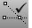

---
---

{: #kanchor25}{: #kanchor26}
# SmartTrackand Guides
 [Where can I find this command?](javascript:void(0);) Toolbars
 [Properties](properties-toolbar.html)  [Standard](standard-toolbar.html)  [Tools](tools-toolbar.html) 
Menus
Tools
Options
SmartTrack is a system of temporary reference lines and points that is drawn in the Rhino viewport using implicit relationships among various 3-D points, other geometry in space, and the coordinate axes' directions.
Temporary infinite lines (tracking lines) and points (smart points) are available to object snaps very much like real lines and points. You can snap to intersections of the tracking lines, perpendiculars, and directly to smart points as well as intersections of tracking lines and real curves. The tracking lines and smart points are displayed for the duration of a command.
You can add or capture new points as needed up to the current maximum after which the oldest smart points disappear as new ones are added. Captured smart points can be cleared at any time if they are not proving useful.
Your browser does not support the video tag.SmartTrack options
SmartTrack™ options manage settings for SmartTrack.
General
Enable SmartTrack and guides
Toggles SmartTrack and guides on and off.
Smart point activation delay ___ milliseconds
Hover time, in milliseconds, for a smart point to be captured.
Max number of smart points
The maximum number of smart points held at any one time.
Appearance
Dotted lines
Sets the tracking line style to dotted.
Line color
Sets tracking line color.
Tan and perp line color
Sets tangent and perpendicular tracking lines color.
Point color
Sets the captured but inactive smart points color.
Active point color
Sets the active smart points color.
Guide color
Sets the color for construction guide lines.
Behavior
Implied From
When a singleSmart pointis highlighted, and you see the ortho cursor with a distance, you can either type a distance or Enter relative coordinates to place a point relative to the active smart point.
Press [Alt](alt-key.html) + [Enter](enter-key.html) to activate the normal distance constraint from the last picked point.Example 1
Start the [Polyline](polyline.html) command.Place some points.With [Point](object-snaps.html#osnap-point) object snap on, hover over one of the previous polyline vertices (or any other snap) to wake up a smart point and pull the cursor away along an ortho tracking line.You should see the [cursor tooltip](modeling-aids-cursor-tooltips.html) telling you a distance from the Smart point and an angle.Type a single number and press [Enter](enter-key.html) to place the next point on the polyline that number of units away from the Smart Point in the direction you are pulling along the tracking line.Typerx,y,zthen the r will make the point [relative](unit-systems.html#relative-construction-plane-and-world-coordinates) to the active smart point.This only works along a tracking line from a single active smart point.Example 2
Start the [Polyline](polyline.html) command.Place some points.With [Point](object-snaps.html#osnap-point) object snap on, hover over one of the previous polyline vertices (or any other snap) to wake up a smart point and pull the cursor away along an ortho tracking line.You should see the [cursor tooltip](modeling-aids-cursor-tooltips.html) telling you a distance from the Smart point and an angle.Type a single number and press [Alt](alt-key.html) + [Enter](enter-key.html) to activate distance constraint for the next pick.Without the [Alt](alt-key.html) key, the pick will be finalized number units away from the active smart point rather than the last point picked.Smart ortho
SetsSmart orthoon or off.Smart orthoautomatically draws ortho tracking lines from the last point picked without the need to specifically go back and capture that point. It is independent from the [Ortho](ortho.html) setting.
Smart orthois like having ortho on and off at the same time. When the cursor is away from ortho directions or object snapped to something, it works like a normal pick. When the cursor is near ortho directions, it works like an ortho pick.
Smart tangents and perpendiculars{: #smarttangents}
Turns on and off the ability to draw tangent and perpendicular tracking lines.
Example
Enable the [end](object-snaps.html#osnap-end) object snap.Draw a curve or a polyline.When you snap to a curve end, you can see the smart tangent tracking line.Your browser does not support the video tag.Example
Enable [Smart tangents and perpendiculars](#smarttangents) .Draw a polyline.Every time you click, a smart point is generated at the current end point of the polyline.Snap to a curve end, the ortho tracking line appears.Your browser does not support the video tag.Parallels
Turns on and off the ability to draw parallel tracking lines.
Example
EnableParallels.Snap to a curve end and another point with a different type of object snap.You will see the parallel tracking line (when the mouse cursor is close to the parallel tracking line).Your browser does not support the video tag.Semi-permanent points
Toggles the retaining of captured points for the duration of a command as opposed to discarding them after each mouse click. For example, when you use the [Copy](copy.html) command, clicking the mouse to place an object does not clear the existing smart points.
Smart point at CPlane origin
The active viewport construction plane origin is automatically tagged as smart point, making it possible to snap to it, and snap to ortho lines radiating from it.
To save options for use on other computers
 [OptionsExport](optionsexport.html) 
Save [Options](options.html) settings to a file.
 [OptionsImport](optionsexport.html#optionsimport) 
Restore [Options](options.html) settings from a file.

# Related commands

## SmartTrack
 [Where can I find this command?](javascript:void(0);) Toolbars
 [Object Snap](object-snap-toolbar.html) 
Menus
Tools
Object Snaps
SmartTrack
The SmartTrack command turns SmartTrack on, off, or toggles the current state.
Steps
 [Specify a command line option.](specifycommandlineoption.html) Command-line options
On
Off
Toggle

### Capture smart points
{: #capture}
To capture smart points automatically
Capture smart points automatically by hovering briefly over an object snap point.To capture smart points manually
Tap [Ctrl](ctrl-key.html) once to place a manual smart point anywhere in space. This makes it easy to for example to place smart points along curves.Your browser does not support the video tag.Tap [Ctrl](ctrl-key.html) twice to clear all smart points.Note
Captured smart points are drawn in their own color and styles: gray with a cross for captured, but not currently active points (that is they are not sending out any tracking lines), and blue for active smart points.Tracking lines are drawn once a smart point is captured and the cursor is in a predictable relation with the captured point(s).In this case, predictable means that the cursor is along or near an ortho line through the point, at or near the intersection between ortho lines from two smart points. Ortho tracking lines pay attention to the [OrthoAngle](ortho.html#orthoangle) setting.When a single smart point is highlighted and you see the ortho cursor with a distance, type a distance or Enter relative coordinates to place a point relative to the active smart point.
## AddGuide
{: #addguide}
 [Where can I find this command?](javascript:void(0);) Toolbars
 [Not on toolbars.](toolbarwhattodo.html) 
Menus
 [Not on menus.](menuwhattodo.html) 
The AddGuide command adds temporary infinite guide/construction lines.

## RemoveGuide
{: #removeguide}
 [Where can I find this command?](javascript:void(0);) Toolbars
 [Not on toolbars.](toolbarwhattodo.html) 
Menus
 [Not on menus.](menuwhattodo.html) 
The RemoveGuide command remove selected temporary infinite guide/construction lines.
Steps
Click on guide to remove.Command-line options
RemoveAll
Removes all guide lines.
See also
 [Use modeling aids](sak-modelingaids.html) 
 [Options](options.html) 
Manage global options: [3D mouse](3dconnexion.html), [alerter](alerter.html), [aliases](aliases.html), [appearance](appearance.html), [context menu](context-menu.html), [display modes](view-displaymode-options.html), [files](files.html), [general](general.html), [idle processor](idleprocessor.html), [keyboard](keyboard.html), [libraries](libraries.html), [licenses](licenses.html), [modeling aids](modeling-aids.html), [mouse](mouse.html), [plug-ins](plug-ins.html), [render](rendering.html), [RhinoScript](rhinoscript.html), [selection menu](selection-menu.html), [toolbars](toolbars.html), [updates and statistics](updates-and-statistics.html), [view](view.html).
&#160;
&#160;
Rhinoceros 6 © 2010-2015 Robert McNeel &amp; Associates.11-Nov-2015
 [Open topic with navigation](modeling-aids-smarttrack.html) 

