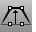
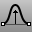

---
---

# Move toolbar
{: #kanchor2355}
 [To open a toolbar](javascript:void(0);) Toolbars can be opened as a free-standing group or added to the current group.
To open a toolbar as a free-standing group
Click theOptionsicon in any toolbar group.On the menu, clickShow Toolbar, and then select the toolbar name from the list.To open a toolbar as a new tab in the current group
Click theOptionsicon in the toolbar group where you want to add the new tab.On the menu, clickShow or Hide Tabs, and then select the toolbar name from the list. [FixedLengthCrvEdit](fixedlengthcrvedit.html) 
Drag points on a curve to change its shape without changing the curve's length.
 [Move](move.html) 
Move objects from one location to another.
 [MoveCrv](movecrv.html) 
Move a polycurve/polyline segment.
 [NamedPosition](namedposition.html) 
Save and restore the location of objects.
 [SoftMove](softmove.html) 
Move objects relative to a center with falloff.
 [SoftEditCrv](softeditcrv.html) 
Move the surrounding curve area smoothly relative to the distance.
 [SoftEditSrf](softeditsrf.html) 
Move the surrounding surface area smoothly relative to the distance.
&#160;
&#160;
Rhinoceros 6 © 2010-2015 Robert McNeel &amp; Associates.11-Nov-2015
 [Open topic with navigation](move-toolbar.html) 

