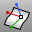

---
---

{: #kanchor1507}{: #kanchor1508}{: #kanchor1509}{: #kanchor1510}{: #kanchor1511}{: #kanchor1512}{: #kanchor1513}
# MoveUVN
 [Where can I find this command?](javascript:void(0);) Toolbars
 [Point Edit](point-edit-toolbar.html) 
Menus
Transform
Panels
Move UVN
The MoveUVN command moves selected surface control points along the surface u, v, and normal [directions](curvesurfacedirection.html).
Your browser does not support the video tag.Options
U/V/N
Moves a control point in the u, v, or normal [direction](curvesurfacedirection.html).
Scale
Sets the scale of the sliders in Rhino units.
UV Move mode
Along tangent
The u and v&#160;sliders move the points in a plane that is roughly tangent to the surface.
Your browser does not support the video tag.Along control polygon
The u and v&#160;sliders move the points along control polygon chords.
Your browser does not support the video tag.Along extensions
The control point will move along the imaginary extensions of the control polygon.
U Symmetry / V Symmetry
Makes it possible to edit two sides of a symmetrical surface at the same time. You must select all points to edit.
Your browser does not support the video tag.Smoothing U / V
Use smoothing beforeMoveUVNto make it possible to combine the actions. Smoothing tends to even out the control point grid, and the other controls can be used for making small changes to the shape.
Your browser does not support the video tag.See also
 [Move objects](sak-move.html) 
&#160;
&#160;
Rhinoceros 6 © 2010-2015 Robert McNeel &amp; Associates.11-Nov-2015
 [Open topic with navigation](moveuvn.html) 

