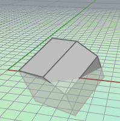
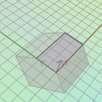
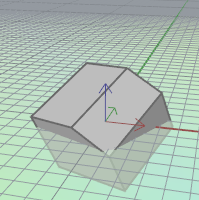
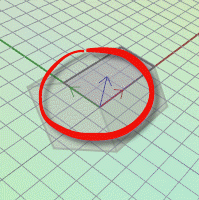

---
---

{: #kanchor1514}{: #kanchor1515}{: #kanchor1516}
# MPlane
 [Where can I find this command?](javascript:void(0);) Toolbars
 [CPlanes](cplanes-toolbar.html) 
Menus
View
 [Viewport title](rhino-window.html#viewport-title-menu) 
Set CPlane
Mobile Construction Plane
The MPlane command sets a mobile construction plane to a selected object and maintain the relationship between the construction plane and the object.

No mobile construction plane.
When you move, rotate, or otherwise transform the object, the construction plane attached to the object transforms as well.
The update mode is controlled by [Modeling Aids](modeling-aids.html) &gt; [Universal](modeling-aids.html#universal-cplane) and [Standard](modeling-aids.html#standard-cplane) settings. Changing between [Universal](modeling-aids.html#universal-cplane) and [Standard](modeling-aids.html#standard-cplane) will not update the currentMPlaneuntil the object that the currentMPlaneis attached to is moved or rotated.
Steps
 [Select](select-objects.html) an object. [Specify command line options](specifycommandlineoption.html) and press [Enter](enter-key.html) when done. [Pick a location](pick-location.html) to establish the x&#160;axis direction or press [Enter](enter-key.html) to accept the previous x-axis direction.Pick a location to establish the mobile construction plane orientation or press [Enter](enter-key.html) to accept the previous direction.
Mobile construction plane attached to slanted surface.
Options
Vertical
TheVerticaloption sets the mobile construction plane vertical to the current mobile construction plane.
ZAxis
TheZAxisoption sets the z&#160;axis instead of the x&#160;axis.
Command-line options
Attach
TheAttachoption sets a new mobile construction plane to an object.
UseObjectPlane
TheUseObjectPlaneoption sets the origin and orientation automatically and depends on the object type.
Surfaces: The tangent plane at location on the surface midway in the U and V domains.Curves: The origin is at the curve start point; the x&#160;direction of the mobile construction plane is tangent to the curve at its start point, with positive x in the curve direction; the y direction is normal to positive y.Clipping planes: The origin goes to the corner of the clipping plane icon, positive z is in the clipping plane's normal direction.Polysurfaces,meshes,point objects: The current construction plane is moved so that the origin is at the center of the object bounding box{: #kanchor1517}.
Mobile construction plane origin at bounding box center.
Automatic
Automatically updates the construction plane when the object position changes.
With theNooption, manually update the construction plane with theRefreshoption.
Detach
TheDetachoption removes the link between the object and the mobile construction plane.
Modify
TheModifyoption changes theAutomaticupdate options for an existingMPlane.
Refresh
TheRefreshoption manually updates the construction plane when theAutomaticupdate option is set to *No*.
Show
TheShowoption displays an axis icon on the object to show the orientation of the construction plane.

Mobile construction plane axis icon.
See also
 [Use construction planes](sak-cplanes.html) 
&#160;
&#160;
Rhinoceros 6 © 2010-2015 Robert McNeel &amp; Associates.11-Nov-2015
 [Open topic with navigation](mplane.html) 

