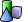
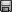
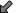
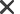
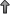
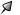
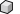

---
---

{: #kanchor1522}{: #kanchor1523}{: #kanchor1524}
# NamedPosition
 [Where can I find this command?](javascript:void(0);) Toolbars
 [Not on toolbars.](toolbarwhattodo.html) 
Menus
Panels
Named Positions
The NamedPosition command saves and restores the location of objects.
Your browser does not support the video tag.Named Positions Panel
 [Panel options](panel-options.html) 
Toolbar
Save As
Saves and names the position of the selected objects.
Restore
Restores the specified saved object position.
Double-click a position name to restore the objects.Delete
Deletes the specified position.
Update selected named position
Resets the location of all of the objects attached to the named position to their current locations.
Append to selected named position
Adds an object in its current location to the selected named position.
Select objects of named position
Selects all objects tagged with the position name.
See also
 [Move objects](sak-move.html) 
&#160;
&#160;
Rhinoceros 6 © 2010-2015 Robert McNeel &amp; Associates.11-Nov-2015
 [Open topic with navigation](namedposition.html) 

