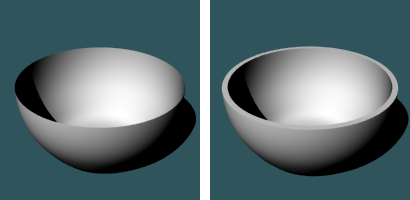
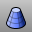
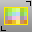

---
---

{: #kanchor3}
# New in Rhino
 [Full Command list](command-list.html) 

## New in Rhino 6
Features
 [Mesh ngon support](ngonulatemesh.html) 
 [Infinite plane](infiniteplane.html) 
Commands
 [AddGuide](modeling-aids-smarttrack.html#addguide) 
Add temporary infinite guide / construction line.
 [Thickness object property](thickness.html) 
Constructs a thickness display mesh for surfaces, polysurfaces, or meshes.
 [BlendCrv](blendcrv.html) 
New options:&#160;BlendStart: PickPoint and CurveEnd.
 [Catenary](catenary.html) 
Creates a curve that a hanging chain or cable assumes under its own weight when supported only at its ends.
 [GumballScaleMode](gumball.html#gumballscalemode) 
Sets the size of the scale handles either relative to the model or to a fixed size.
 [ChangeSpace](changespace.html) 
Change the "space" of object from layout to detail and vise versa.
 [DeleteMeshNgons](ngonulatemesh.html#deletemeshngons) 
Removes ngon groups from a mesh.
 [DragStrength](dragmode.html#dragstrength) 
Sets the amount of object drag as a percentage of mouse movement to control the speed of the drag movement.
 [GumballAutoReset](gumball.html#gumballautoreset) 
Resets the gumball widget alignment.
 [GumballScaleMode](gumball.html#gumballscalemode) 
Sets the size of the scale handles either relative to the model or to a fixed size.
 [Isolate](hide.html#isolate) 
Hide all but the currently selected objects.
 [IsolateLock](lock.html#isolatelock) 
Lock all but the currently selected objects.
 [MeshFromLines](meshfromlines.html) 
Construct a mesh from lines.
 [MeshTruncatedCone](meshtruncatedcone.html) 
Command name changed from MeshTCone to MeshTruncatedCone.
 [NgonulateMesh](ngonulatemesh.html) 
Creates ngons from regions of connected coplanar welded faces.
 [OffsetMultiple](offsetmultiple.html) 
Copy curves or surface edges parallel to the original.
 [Picture](picture.html) 
Draw a rectangular planar surface with a bitmap texture.
 [RemoveGuide](modeling-aids-smarttrack.html#removeguide) 
Remove temporary infinite guide / construction line.
 [RenderReportMissingImageFiles](render.html#renderreportmissingimagefiles) 
Open the missing image files report.
 [RenderSettings](render.html#rendersettings) 
Open the [Render](rhino-render.html) panel.
 [RText](text.html#rtext) 
Create two-dimensional rich text. Rich text can be formatted on a word-by-word or letter-by-letter basis similar to a word processor.
 [SelClosedSubD](subdfrommesh.html#selopensubd) &#160;(Work in Progress release only)
Select all Rhino SubD objects in the model that do not have a boundary and are not locked or hidden.
 [SelConnectedMeshFaces](select-mesh-faces-commands.html#selmeshfacesbyarea) Select mesh faces from the parent mesh object that are connected to a selected face.
 [SelControlPoint](selection-commands.html#selpt) 
Select all [control points](pointson.html).
 [SelControlPointRegion](selection-commands.html#selpt) 
Selects a range of [control points](pointson.html) on a curve or surface.
 [SelFence](selection-commands.html#selfence) 
Select a using a crossing sketched polyline.
 [SelMeshFacesByArea](select-mesh-faces-commands.html#selmeshfacesbyarea) 
Select mesh faces from the parent mesh object that are within a specified range of area.
 [SelMeshFacesByAspectRatio](select-mesh-faces-commands.html#selmeshfacesbyaspectratio) 
Select mesh faces from the parent mesh object that are greater than the specified aspect ratio limit.
 [SelMeshFacesByDraftAngle](select-mesh-faces-commands.html#selmeshfacesbydraftangle) 
Separate mesh faces from the parent mesh object based on the angle of the faces to the view.
 [SelMeshFacesByEdgeLength](select-mesh-faces-commands.html#selmeshfacesbyedgelength) Select mesh faces from the parent mesh object that have an edge length greater or less than a specified value.
 [SelOpenSubD&#160;](subdfrommesh.html#selopensubd) (Work in Progress release only)
Select all Rhino SubD objects in the model that have a boundary and are not locked or hidden.
 [SelPicture](selection-commands.html#selpicture) 
Select all objects created with the [Picture](picture.html) command.
 [SelPlanarCrv](selection-commands.html#selplanarcrv) 
Select all planar curves.
 [SelPlanarSrf](selection-commands.html#selplanarsrf) 
Select all planar surfaces.
 [SelSmallSrf](selection-commands.html#selsmallsrf) 
Select all surfaces smaller than a specified area.
 [SelVolumeObject](selection-commands.html#selvolumeobject) 
Select objects enclosed by an extrusion object, surface, polysurface, or mesh.
 [ShowDir](dir.html#showdir) 
Open the Direction Analysis control and turn on direction analysis for curves, surfaces, and polysurfaces.
 [ShowDirOff](dir.html#showdiroff) 
Close the Direction Analysis control, and turn off direction analysis.
 [ShowEnds](showends.html) 
Open the End Analysis control, and display the endpoints of curves.
 [ShowEndsOff](showends.html#showends) 
Close the End Analysis control, and turn off endpoints of curves.
 [SubDFromMesh&#160;](subdfrommesh.html) 
Convert an ordinary mesh into a SubD object.
 [SystemInfo](systeminfo.html) 
Reports information about the computer hardware and operating system.
 [TruncatedCone](truncatedcone.html) 
Command name change from TCone to TruncatedCone.
 [Unisolate](hide.html#unisolate) 
Show objects previously hidden by the [Isolate](hide.html#isolate) command.
 [UnisolateLock](lock.html#unisolatelock) 
Unlock objects previously hidden by the [IsolateLock](lock.html#isolatelock) command.
 [ZoomEnds](showends.html) 
Zoom to include all end display markers on selected curves.
Options and Properties
SmartTrack: [AddGuide](modeling-aids-smarttrack.html#addguide) / [RemoveGuide](modeling-aids-smarttrack.html#removeguide) 
 [InfinitePlane](infiniteplane.html) 
Interface changes
 [ApplyCurvePiping](curvepiping.html), [ApplyDisplacement](displacement.html), [ApplyEdgeSoftening](edgesoftening.html), and [ApplyShutlining](shutlining.html) are no longer commands, but are now part of [object properties](properties.html).
 [Sub-object selection](selection-commands.html#sub-object-selection) for polycurves and polylines.
 [Decal](decal.html) positioning.
 [Isocurve density](properties.html#isocurvedensity) settings.
Default [CPlanes](cplane.html) (World Top, Right, and Front) are now included in [NamedCPlane](namedcplane.html) panel.
Rotate [Environment](environmenteditor.html) widget.
 [MappingWidget](texturemapping.html#mappingwidget) improvements.
 [Gumball](gumball.html) Alignment, Relocation, and translation plane improvements.
 [Rendering Ambient Bottom](rhino-render.html#ambient) setting removed.
 [Unwrap](texturemapping.html#unwrap) and [UVEditor](texturemapping.html#uveditor) can be used on multiple objects.
Keyboard entry enhanced for [Repeat](repeat.html) and [History toggle.](history.html#commandprefixes) 
 [Command-line calculator](command-line-calculator.html) support.
 [Toggle sub-object selection.](selection-commands.html#sub-object-selection) 
 [Percentage object snap](object-snaps.html#osnap-percentage) improvement with direction indicators.
 [FilletEdge](filletedge.html) edit multiple handles.
 [Orient3Pt](orient3pt.html) markers.
 [Rebuild](rebuild.html) - extrusions are treated as surfaces.
 [Crossing selection](selection-commands.html#selcrossing) for mesh faces.
 [Curve piping](curvepiping.html), [Displacement](displacement.html), [Edge Softening](edgesoftening.html), [Shut lining](shutlining.html), and [Thickening](thickness.html) are now object properties.
 [GroundPlane](groundplane.html) is on by default in Rendered viewports.
 [GroundPlane](groundplane.html) - New Autoheight feature.
 [Sweep1](sweep1.html) and [Sweep2](sweep2.html) dialogs update.
 [SelNakedMeshEdgePt](selection-commands.html#selnakedmeshedgept) - New IncludeUnweldedEdges=Yes / No.
Toolbars
 [ScaleDimstyle](dimensions-style.html#scaledimstyle) added to [Dimension Styles](dimensions-style.html).
 [Percentage snap](object-snaps.html#osnap-percentage) added to [Osnap control](object-snaps.html).
 [ShowEnds](showends.html) added to [Analyze](analyze-toolbar.html) toolbar.
 [InfinitePlane](infiniteplane.html) added to [Select](select-toolbar.html) toolbar.
Menus
 [Linked viewports](view.html#linkedviewports) added

## Obsolete in Rhino 6
{: #obsolete-commands}
ApplyCurvePiping
Replaced with [Curve Piping](curvepiping.html) object property.
ApplyDisplacement
Replaced with [Displacement](displacement.html) object property.
ApplyEdgeSoftening
Replaced with [Edge Softening](edgesoftening.html) object property.
ApplyShutlining
Replaced with [Shut lining](shutlining.html) object property.
ApplyThickness
Replaced with [Thickness](thickness.html) object property.
ApplyWatermark
Deleted.
BackgroundBitmap
Replaced with [Picture](picture.html) command.
CheckMesh
Added to [Check](check.html) command.
FindWatermark
Deleted.
GradientView
GradientView is now a test command. It does not autocomplete, but may still be accessed if the command name is typed out.
PictureFrame
Replaced with [Picture](picture.html) command.
MeshTCone
Name change to [MeshTruncatedCone](meshtruncatedcone.html).
Options Relative tolerance setting
Deleted.
TCone
Name change to [TruncatedCone](truncatedcone.html).
ViewportProperties dialog box
Replaced with [Viewport Properties panel](viewport.html).

&#160;
&#160;
Rhinoceros 6 © 2010-2015 Robert McNeel &amp; Associates.11-Nov-2015
 [Open topic with navigation](newinrhino.html) 

