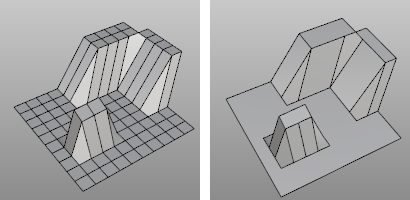
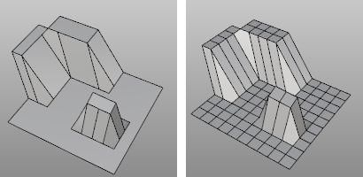

---
---

# NgonulateMesh
{: #kanchor549}
 [Where can I find this command?](javascript:void(0);) Toolbars
 [Not on toolbars.](toolbarwhattodo.html) 
Menus
 [Not on menus.](menuwhattodo.html) 
The NgonulateMesh command creates ngons from regions of connected coplanar welded faces.

Mesh object (left), Ngonulated mesh object (right).

# DeleteMeshNgons
{: #kanchor550}
{: #deletemeshngons}
 [Where can I find this command?](javascript:void(0);) Toolbars
 [Not on toolbars.](toolbarwhattodo.html) 
Menus
 [Not on menus.](menuwhattodo.html) 
The DeleteMeshNgons command removes ngon groups from a mesh.

"Ngonulated" mesh object (left), mesh object with ngons deleted (right).
See also
 [Edit mesh objects](sak-meshtools.html) 
&#160;
&#160;
Rhinoceros 6 © 2010-2015 Robert McNeel &amp; Associates.11-Nov-2015
 [Open topic with navigation](ngonulatemesh.html) 

