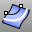

---
---

{: #kanchor1553}
# OffsetCrvOnSrf
 [Where can I find this command?](javascript:void(0);) Toolbars
 [Curve Tools](curve-tools-toolbar.html) 
Menus
Curve
Offset
Offset Curve on Surface
The OffsetCrvOnSrf command copies a curve or surface edge on a surface so that all locations on the copied curve are a specified distance from the original curve and lie on the surface.
Steps
 [Select](select-objects.html) a curve on a surface.Select the base surface.Type the offset distance.Your browser does not support the video tag.Command-line options
ThroughPoint
Offsets through a picked point instead of at a distance.
TheThroughPointoption lets you keep picking offset locations for the next curve on the surface at any distance.
Flip
Reverses the [direction](dir.html#normaldirection).
Number
Specifies the number of curves to be offset. The curves are each offset the offset distance from the last curve.
See also
 [Create curves from other objects](sak-curvefromobject.html) 
&#160;
&#160;
Rhinoceros 6 © 2010-2015 Robert McNeel &amp; Associates.11-Nov-2015
 [Open topic with navigation](offsetcrvonsrf.html) 

