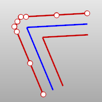

---
---

{: #kanchor1555}
# OffsetMultiple
 [Where can I find this command?](javascript:void(0);) Toolbars
 [Not on toolbars.](toolbarwhattodo.html) 
Menus
 [Not on menus.](menuwhattodo.html) 
 [&#160;History enabled](historyenabled.html) 
The OffsetMultiple command copies multiple curves so that all locations on the copied curves are a specified distance from the original curve.
Note
All open curves offset toward the cursor.When offsetting closed curves, if the side-to-offset point is inside a curve, the offsets for other closed curves will also be inside.Islands (closed curves inside other closed curves) are recognized and offset in the opposite direction from the container closed curves.Steps
 [Select](select-objects.html) curves and edges.Click on to specify the side.For best results, use proportionately small offset distances and smooth curves; otherwise, you may get kinks and doubled-back curves.Command-line options
Distance
Sets the offset distance.
Corner
Specifies how offset corner [continuity](continuity-descriptions.html) handled.
The Corner options only apply if the offset direction is to the "outside."
Sharp
The corners of the offset curves will be extended to meet at sharp corners with position (G0) continuity.

Round
The corners of the offset curves will be filled with arc segments with tangent (G1) continuity.

Smooth
The corners of the offset curves will be filled with blend segments with curvature (G2) continuity.

Chamfer
The corners of the offset curves will be filled with a straight line between their endpoints.

OffsetCount
Specifies the number of curves that will be offset.
See also
 [Offset](offset.html) 
Copy a curve parallel to the original.
 [OffsetMesh](offsetmesh.html) 
Copy a mesh parallel to the original.
 [OffsetCrvOnSrf](offsetcrvonsrf.html) 
Copy a curve on a surface parallel to the original.
 [OffsetNormal](offsetnormal.html) 
Copy a curve on a surface parallel to the original in the surface normal direction.
 [Create curves from other objects](sak-curvefromobject.html) 
&#160;
&#160;
Rhinoceros 6 © 2010-2015 Robert McNeel &amp; Associates.11-Nov-2015
 [Open topic with navigation](offsetmultiple.html) 

