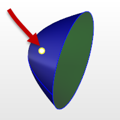

---
---

{: #kanchor1646}{: #kanchor1647}
# Paraboloid
 [Where can I find this command?](javascript:void(0);) Toolbars
 [Solids Creation](solid-creation-toolbar.html)  [Solids Sidebar](solids-sidebar-toolbar.html) 
Menus
Solid
Paraboloid
The Paraboloid command draws a parabolic surface.
Steps
Follow the prompts for the selected option. If no option is specified, the default option is used.Your browser does not support the video tag.Command-line options
Focus
The focus option lets you pick a focus point, direction, and end location.
Focus steps
 [Pick](pick-location.html) the focus.Pick a direction.This is the "open" direction.Pick the end.The focus to vertex distance and length of the parabola display at the command prompt.Your browser does not support the video tag.Vertex
The Vertex option lets you pick a vertex point, a focus point, and an end location.
Vertex steps
 [Pick](pick-location.html) the vertex.Pick the focus.This is the open direction.Pick the end.The focus to vertex distance and length of the parabola display at the command prompt.Your browser does not support the video tag.MarkFocus
The MarkFocus option places a point object at the focus location.

Solid
The Solid option fills the base with a surface to form a closed solid.
Your browser does not support the video tag.See also
 [Create solid objects](sak-solid.html) 
&#160;
&#160;
Rhinoceros 6 © 2010-2015 Robert McNeel &amp; Associates.11-Nov-2015
 [Open topic with navigation](paraboloid.html) 

