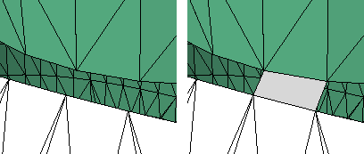

---
---

{: #kanchor1652}
# PatchSingleFace
 [Where can I find this command?](javascript:void(0);) Toolbars
 [Mesh Tools](mesh-tools-toolbar.html) 
Menus
Mesh
Mesh Repair Tools
Patch Single Face
The PatchSingleFace command fills a mesh hole with a single mesh face.

Note
Some STL/SLA printers have problems if meshes contain many long, thin facets. These can slow the printer's slicing process down, produce odd printed results, and run the printer out of memory.The [MeshRepair](meshrepair.html) command may be useful when tuning up meshes for STL/SLA printing.Steps
 [Select](select-objects.html) two edges or vertices of a mesh.Command-line options
JoinMesh
Joins the new faces to the original mesh.
See also
 [Edit mesh objects](sak-meshtools.html) 
&#160;
&#160;
Rhinoceros 6 © 2010-2015 Robert McNeel &amp; Associates.11-Nov-2015
 [Open topic with navigation](patchsingleface.html) 

