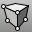

---
---

{: #kanchor1656}
# PerspectiveMatch
 [Where can I find this command?](javascript:void(0);) Toolbars
 [Set View](set-view-toolbar.html) 
Menus
View
 [Viewport title](rhino-window.html#viewport-title-menu) 
Set Camera
Match Wallpaper Image
The PerspectiveMatch command manually matches the perspective view to the image used as the viewport wallpaper.

Steps
Use [Wallpaper](viewport.html#wallpaper) ( [ViewportProperties](viewport.html) ) to place an image in a perspective viewport.Click in the viewport with the wallpaper image to make it the active viewport, and typePerspectiveMatch.Carefully pick a location on the wallpaper image, and then carefully pick the corresponding 3-D location on the model.Pick pairs of image and 3-D points until you have at least six pairs, and press [Enter](enter-key.html) .Note
The image must be a true perspective image. Photos taken with lenses that remove perspective distortion will not work.The Center of the image must be on the camera's viewing axis. In particular, an image or photo that has had non-symmetric cropping will not work because the Center of the resulting image is not the same as the Center of the original image.Pick carefully. Accurate picking is rewarded with accurate results.Make the image view large. This aids in accurate image location picking.If possible, pick point pairs where an end or point snap can be used to select the 3-D point. This aids in accurate 3-D point picking.Pick locations that are spread out in all dimensions.See also
 [Navigate in the viewports](sak-navigate.html) 
&#160;
&#160;
Rhinoceros 6 © 2010-2015 Robert McNeel &amp; Associates.11-Nov-2015
 [Open topic with navigation](perspectivematch.html) 

