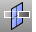
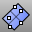
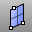
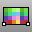

---
---

# Plane toolbar
{: #kanchor2358}
 [To open a toolbar](javascript:void(0);) Toolbars can be opened as a free-standing group or added to the current group.
To open a toolbar as a free-standing group
Click theOptionsicon in any toolbar group.On the menu, clickShow Toolbar, and then select the toolbar name from the list.To open a toolbar as a new tab in the current group
Click theOptionsicon in the toolbar group where you want to add the new tab.On the menu, clickShow or Hide Tabs, and then select the toolbar name from the list. [CutPlane](cutplane.html) 
Create planar surfaces through objects at specified locations.
 [Plane](plane.html) 
Draw a rectangular planar surface.
 [Plane, *3Point* ](plane.html) 
Draw a rectangular planar surface from three points.
 [PlaneThroughPt](planethroughpt.html) 
Fit a rectangular planar surface through points.
 [Plane, *Vertical* ](plane.html) 
Draw a rectangular planar surface vertical to the construction plane.
 [Picture](picture.html) 
Draw a rectangular planar surface with a bitmap texture.
&#160;
&#160;
Rhinoceros 6 © 2010-2015 Robert McNeel &amp; Associates.11-Nov-2015
 [Open topic with navigation](plane-toolbar.html) 

