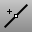
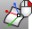

---
---

# Point Edit toolbar
{: #kanchor2360}
 [To open a toolbar](javascript:void(0);) Toolbars can be opened as a free-standing group or added to the current group.
To open a toolbar as a free-standing group
Click theOptionsicon in any toolbar group.On the menu, clickShow Toolbar, and then select the toolbar name from the list.To open a toolbar as a new tab in the current group
Click theOptionsicon in the toolbar group where you want to add the new tab.On the menu, clickShow or Hide Tabs, and then select the toolbar name from the list. [CullControlPolygon](cullcontrolpolygon.html) 
Toggle the display of control points that are behind the surface.
 [DragMode](dragmode.html) 
Specify the plane object dragging will be parallel to.
Link to [Drag Mode toolbar](drag-mode-toolbar.html) 
 [EditPtOn](pointson.html#editpton) 
Display points on the curve evaluated at [knot](knot.html) averages.
 [PointsOff](pointson.html#pointsoff) 
Turn off [control](pointson.html), [edit](pointson.html#editpton), and [solid](pointson.html#solidpton) points display.
 [EndBulge](endbulge.html) 
Adjust the shape of a curve at its end or a surface near an untrimmed edge.
 [HBar](hbar.html) 
Edit a curve or surface with Bézier curve editing handles.
 [InsertControlPoint](insertcontrolpoint.html) 
Add control points to a curve or a row of control points to a surface.
 [InsertKink](insertkink.html) 
Add kinks to a curve.
 [InsertKnot](insertknot.html) 
Add knots to curves or surfaces.
 [MoveUVN](moveuvn.html) 
Move curve or surface control points along the u, v, and normal directions of the object.
 [MoveUVN, *Off* ](moveuvn.html) 
Turns off MoveUVN mode.
 [PointsOn](pointson.html) 
Display curve and surface control points.
 [PointsOff](pointson.html#pointsoff) 
Turn off [control](pointson.html), [edit](pointson.html#editpton), and [solid](pointson.html#solidpton) points display.
 [PtOffSelected](pointson.html#ptoffselected) 
Turn off control and edit points for selected objects.
 [RemoveControlPoint](insertcontrolpoint.html#removecontrolpoint) 
Remove control points from a curve or surface.
 [RemoveKnot](insertknot.html#removeknot) 
Delete specified knots from a curve or surface.
 [Weight](weight.html) 
Edit the weight of a curve or surface control point.
&#160;
&#160;
Rhinoceros 6 © 2010-2015 Robert McNeel &amp; Associates.11-Nov-2015
 [Open topic with navigation](point-edit-toolbar.html) 

