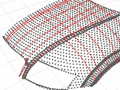

---
---

{: #kanchor1730}{: #kanchor1731}{: #kanchor1732}{: #kanchor1733}{: #kanchor1734}
# PointCloudSection
 [Where can I find this command?](javascript:void(0);) Toolbars
 [Curve From Object](curve-from-object-toolbar.html) 
Menus
Curve
Point Cloud
Point Cloud Section
The PointCloudSection command creates a planar curve by intersecting a plane with a cloud of points.

Steps
 [Select](select-objects.html) point or point cloud objects, and press [Enter](enter-key.html). [Pick](pick-location.html) the start of the section plane.Pick the end of the section plane, and press [Enter](enter-key.html) .Section curves are created by intersecting the points with the section plane, which is perpendicular to the construction plane.Point Cloud Section Options
Curve creation options
Create smooth curves
Creates a smooth curve. You can create both a curve and a polyline.
Create polylines
Creates a polyline. You can create both a curve and a polyline.
Create open/closed curves
Creates a open or closed curves.
Fitting tolerance
The tolerance used to fit the curve through the polyline.
Point sampling options
Maximum distance to plane
The thickness of the "slab" around the plane from which sample points are taken. Those sample points are projected to the section plane and a polyline is found that connects them. This distance depends on the size of the point cloud and the spacing of the points.
Minimum distance between points
A threshold for the minimum spacing between adjacent sample points. If there are points closer than that, some are not used.
See also
 [Create curves from other objects](sak-curvefromobject.html) 
&#160;
&#160;
Rhinoceros 6 © 2010-2015 Robert McNeel &amp; Associates.11-Nov-2015
 [Open topic with navigation](pointcloudsection.html) 

