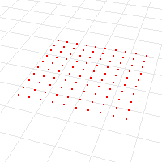

---
---

{: #kanchor1737}{: #kanchor1738}
# PointGrid
 [Where can I find this command?](javascript:void(0);) Toolbars
 [Point](point-toolbar.html) 
Menus
 [Not on menus.](menuwhattodo.html) 
The PointGrid command draws a rectangular grid of point objects.

Steps
Type the number of points in the x&#160;direction.Type the number of points in the y&#160;direction.See the [Rectangle](rectangle.html) command for detailed option descriptions.Draw a defining rectangle for the grid.A [point cloud](pointcloud.html) object is created with points placed in a rectangular array.See also
 [Point](point.html) 
Draw a single point object.
&#160;
&#160;
Rhinoceros 6 © 2010-2015 Robert McNeel &amp; Associates.11-Nov-2015
 [Open topic with navigation](pointgrid.html) 

