---
---

{: #kanchor1748}
# Polygon
 [Where can I find this command?](javascript:void(0);) Toolbars
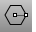 [Curve Drawing](curve-drawing-toolbar.html)  [Main1](main1-toolbar.html)  [Polygon](polygon-toolbar.html) 
Menus
Curve
Polygon
Center, Radius
By Edge
Star
The Polygon command draws a closed polyline with a specified number of sides.
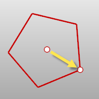
Steps
Follow the prompts for the selected option. If no option is specified, the default option is used.Polygon options
NumSides
The NumSides option specifies the number of sides for the polygon.
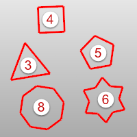
Vertical
The Vertical option draws a polygon perpendicular to the construction plane.
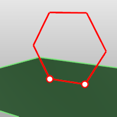
{: #aroundcurve}AroundCurve
The AroundCurve option draws a polygon perpendicular to a curve.
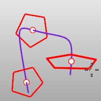
To create a polygon around a curve
 [Select](select-objects.html) a curve and [pick](pick-location.html) the location on the curve and radius.Mode
Inscribed
The Inscribed option draws the polygon where the corners of the sides touch an imaginary circle of a specified radius.
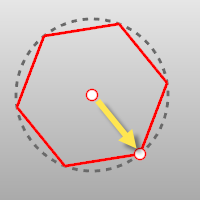
Inscribed steps
 [Pick](pick-location.html) the center.Pick a corner.{: #circumscribed}Circumscribed
The Circumscribed option draws the polygon where the midpoints of the sides touch an imaginary circle of a specified radius.
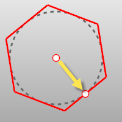
Circumscribed steps
 [Pick](pick-location.html) the center.Pick the midpoint of the polygon edge.{: #edge}Edge
The Edge option draws a polygon by defining one edge.
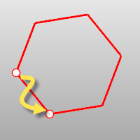
Edge steps
 [Pick](pick-location.html) the start of the edge.Pick the end of the edge.Edge option
Flip
Flips the polygon about the edge you are drawing.
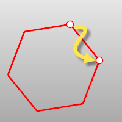
{: #star}Star
The Star option draws a star-shaped polygon.
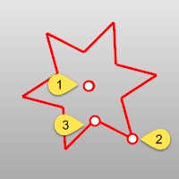
Star steps
 [Pick](pick-location.html) the center (1).Pick the corner (2).Pick the radius for the imaginary circle defining the second star radius (3).Star option
Automatic
If the polygon has 5 or more sides, the Automatic option creates a star where the size of the outer and inner points are equal.
See: [Wikipedia: Regular star polygons](http://en.wikipedia.org/wiki/Regular_polygon#Regular_star_polygons).
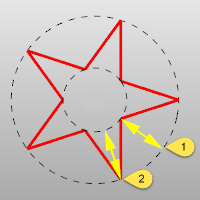
Distances 1 and 2 are equal.
See also
 [Draw lines and curves](sak-curve.html) 
 [Wikipedia:&#160;Regular polygon](http://en.wikipedia.org/wiki/Regular_polygon) 
&#160;
&#160;
Rhinoceros 6 © 2010-2015 Robert McNeel &amp; Associates.11-Nov-2015
 [Open topic with navigation](polygon.html) 

