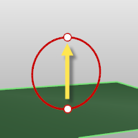
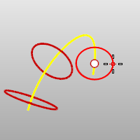

---
---

{: #kanchor1811}
# Pyramid
 [Where can I find this command?](javascript:void(0);) Toolbars
 [Solids Creation](solid-creation-toolbar.html)  [Solids Sidebar](solids-sidebar-toolbar.html) 
Menus
Solid
Pyramid
The Pyramid command draws a pyramid.
Steps
Draw the base polygon.See the [Polygon](polygon.html) command for option descriptions. [Pick](pick-location.html) the end of the pyramid (apex), or type a value to set the height.Your browser does not support the video tag.Options
Direction constraint options
Direction constraints restrict the direction of the circle.
None
The center can be anywhere in 3-D space.
 [Pick](pick-location.html) the second point anywhere using [elevator mode](cursor-constraints.html#elevator-mode), [object snaps](object-snaps.html) or other [modeling aids](modeling-aids.html) .Vertical
Draws an object perpendicular to the construction plane.
 [Pick](pick-location.html) the center and a radius or diameter.AroundCurve
Draws a circle perpendicular to a curve.
 [Select](select-objects.html) a curve and [pick](pick-location.html) the center of the circle on the curve and aRadiusorDiameter.Solid
The Solid option fills the base with a surface to form a closed solid.
See also
 [Create solid objects](sak-solid.html) 
&#160;
&#160;
Rhinoceros 6 © 2010-2015 Robert McNeel &amp; Associates.11-Nov-2015
 [Open topic with navigation](pyramid.html) 

