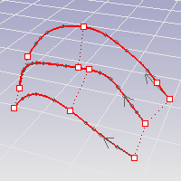

---
---

{: #kanchor1822}{: #kanchor1823}{: #kanchor1824}
# Rebuild
 [Where can I find this command?](javascript:void(0);) Toolbars
 [Curve Tools](curve-tools-toolbar.html) 
 [Surface Tools](surface-tools-toolbar.html) 
Menus
Edit
Rebuild
The Rebuild command reconstructs selected curves or surfaces to a specified [degree](degree.html) and [control point](controlpoint.html) number.
Steps
 [Select](select-objects.html) the curves or surfaces.Your browser does not support the video tag.
## Curves and extrusion objects
To rebuild curves
ClickPreviewto see what the rebuilt curves will look like.When you are satisfied with the results, clickOK.Note
Turn on [control points](pointson.html) and [curvature graph](curvaturegraph.html) to see the details of the curve structure.A group of curves will be rebuilt with curves of a specified degree and specified number of [control points](pointson.html). The [knot](knot.html) of the resulting curve more evenly spaced. To rebuild a curve with uneven knot spacing but a more accurate fit, use the [FitCrv](fitcrv.html) command.Rebuild options
PointCount
Reports in parentheses the current number and sets the number of [control points](pointson.html) in the result.
Degree
Reports in parentheses the current number and sets the [degree](degree.html) of the curve.
When drawing a high-degree curve, the output curve will not be the degree you request unless there is at least one more [control point](controlpoint.html) than the degree.
DeleteInput
Deletes the original geometry.
Create new object on current layer
Creates the new objects on the current layer. Clear this check box to place the new objects on the layer of the original curves.
Maximum deviation
Reports the maximum deviation from the original curve when Preview is clicked.
 **Preview** 
Displays a preview of the output.
If you change the settings, click **Preview** again to refresh the display.
Command-line option
To access hidden command-line options
Type ahyphenin front of the command name:-Rebuild.SelectMasterCurve
Select a curve to use as a template for setting the point count and degree.

## Surfaces
To rebuild surfaces
ClickPreviewto see what the rebuilt surfaces will look like.When you are satisfied with the results, clickOK.Your browser does not support the video tag.Rebuild Surface Options
Point count
U
Reports in parentheses the current number and sets the number of points in the u [direction](curvesurfacedirection.html).
V
Reports in parentheses the current number and sets the number of points in the v [direction](curvesurfacedirection.html).
Degree
U
Reports in parentheses the current number and sets the [degree](degree.html) in the u&#160; [direction](curvesurfacedirection.html).
V
Reports in parentheses the current number and sets the [degree](degree.html) in the v&#160; [direction](curvesurfacedirection.html).
Options
DeleteInput
Deletes the original geometry.
Current Layer
Creates the new surfaces on the current layer. Clear this checkbox to place the new surfaces on the layer of the original surfaces.
Retrim
Trims the rebuilt surface with the original trimming curves.
Span counts
U
Reports in parentheses the minimum number of spans and the proposed number of spans in the u&#160;direction.
V
Reports in parentheses the minimum number of spans and the proposed number of spans in the v&#160;direction.
Maximum deviation
Reports the maximum deviation from the original surface.
 **Calculate** 
The calculation tests how far away the new surface is at knot line intersections and half-way between knot lines. Conducts tests at knot line intersections and halfway between knot lines.
The display color indicates how far away the new surface is from the original. Points are green if the surface is within absolute tolerance, yellow if it is between tolerance and 10 times tolerance, and red if it is farther away than that.
The lines are 10 times longer than the measured deviation in the direction of the deviation.
 **Preview** 
Displays a preview of the output.
If you change the settings, click **Preview** again to refresh the display.
{: #kanchor1825}

# RebuildCrvNonUniform
{: #rebuildcrvnonuniform}
 [Where can I find this command?](javascript:void(0);) Toolbars
 [Curve Tools](curve-tools-toolbar.html) 
Menus
 [Not on menus.](menuwhattodo.html) 
The RebuildCrvNonUniform command interactively modifies selected curves by non-uniformly re-spacing the control points.
Steps
 [Select](select-objects.html) the curves.Drag the points on the curves.Click the direction arrows to reverse the curve direction.Command-line options
RequestedTolerance
Specifies the maximum distance the rebuilt curves can deviate from the originals. If you do not provide enough control points, the rebuilt curves may deviate more than RequestedTolerance from the originals.
The maximum deviation from the original curves is reported at the command line and marked with a point on the curve.
MaxPointCount
Specifies the maximum number of control points per curve used to rebuild.
Quarters
Displays two more controls along each curve to influence how the RebuildCrvNonUniform command distributes control points. The controls at the end of the curves can be used to shorten the resulting curves.
DeleteInput
Yes
Deletes the original geometry.
No
Retains the original geometry.
ResetPoints
Resets the editing points to their original locations.
See also
 [Edit surfaces](sak-surfacetools.html) 
&#160;
&#160;
Rhinoceros 6 © 2010-2015 Robert McNeel &amp; Associates.11-Nov-2015
 [Open topic with navigation](rebuild.html) 

