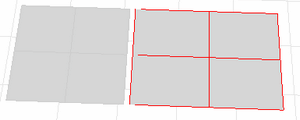

---
---

{: #kanchor1826}{: #kanchor1827}{: #kanchor1828}
# RebuildEdges
 [Where can I find this command?](javascript:void(0);) Toolbars
 [Edge Tools](edge-tools-toolbar.html)  [Surface Tools](surface-tools-toolbar.html) 
Menus
Surface and Analyze
Edge Tools
Rebuild Edges
The RebuildEdges command restores original 3-D surface edges that have been forced away from the surface through editing.
This command is useful for restoring original 3-D edges of surfaces after exploding a polysurface into separate surfaces.
Steps
 [Select](select-objects.html) an object.Example
Draw two planes several units apart.Force Rhino to join the surfaces with the [JoinEdge](joinedge.html) command. [Explode](explode.html) the object and then use theRebuildEdgescommand to restore the edges.
Joined and exploded polysurface. Edges are pulled away from the surface.
Command-line option
Tolerance
Overrides the [system tolerance](units.html#absolutetolerance) setting.
See also
 [Edit surfaces](sak-surfacetools.html) 
&#160;
&#160;
Rhinoceros 6 © 2010-2015 Robert McNeel &amp; Associates.11-Nov-2015
 [Open topic with navigation](rebuildedges.html) 

