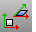

---
---

{: #kanchor1861}{: #kanchor1862}
# RemapCPlane
 [Where can I find this command?](javascript:void(0);) Toolbars
 [Transform](transform-toolbar.html) 
Menus
Transform
Orient
Remap to CPlane
The RemapCPlane command reorients selected objects to a different construction plane.
Steps
 [Select](select-objects.html) objects.Click in the viewport that contains the construction plane to which you want to map the objects.The objects are moved and rotated so they have the same relationship to the new construction plane as they had to the original construction plane.Your browser does not support the video tag.Command-line options
Copy
 [&#160;History enabled](historyenabled.html) 
The Copy option specifies whether or not the objects are copied. A plus signappears at the cursor when copy mode is on.
The [RememberCopyOptions](remembercopyoptions.html) command determines whether the selected option is used as the default.
See also
 [Transform objects](sak-transform.html) 
&#160;
&#160;
Rhinoceros 6 © 2010-2015 Robert McNeel &amp; Associates.11-Nov-2015
 [Open topic with navigation](remapcplane.html) 

