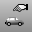
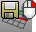
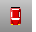
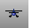
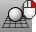

---
---

# Render Sidebar toolbar
{: #kanchor2365}
 [To open a toolbar](javascript:void(0);) Toolbars can be opened as a free-standing group or added to the current group.
To open a toolbar as a free-standing group
Click theOptionsicon in any toolbar group.On the menu, clickShow Toolbar, and then select the toolbar name from the list.To open a toolbar as a new tab in the current group
Click theOptionsicon in the toolbar group where you want to add the new tab.On the menu, clickShow or Hide Tabs, and then select the toolbar name from the list. [Cancel](cancel.html) 
Cancel the current command and deselects objects.
 [Cancel, *All* ](cancel.html) 
Turns off [Points](pointson.html), [CurvatureGraph](curvaturegraph.html), [EMap](emap.html), [Zebra](zebra.html), [MoveUVN](moveuvn.html), [CurvatureAnalysis](curvatureanalysis.html), and deselects objects.
 [DollyZoom](dollyzoom.html) 
Move the camera location and change the lens length at the same time.
 [Move](move.html) 
Move objects from one location to another.
Link to [Transform toolbar](transform-toolbar.html) 
 [MoveTargetToObjects](movetargettoobjects.html) 
Move the target to the center of selected objects.
 [NamedView](namedview.html) 
Manage the named views.
 [NamedView, *Save* ](namedview.html#save-as) 
Save a named view.
 [NamedView, *Restore* ](namedview.html#restore) 
Restore a named view.
 [PerspectiveMatch](perspectivematch.html) 
Allow matching the view to the Wallpaper image.
 [Set 2-Point Perspective](viewport.html#two-point-perspective) 
Set the projection to two-point perspective.
 [PerspectiveAngle](perspectiveangle.html) 
Set the viewport field-of-view angle.
 [SetView, *World Back* ](setview.html#worldback) 
Change the view to the world back view.
 [SetView, *World Bottom* ](setview.html#worldbottom) 
Change the view to the world bottom view.
 [SetView, *World Front* ](setview.html#worldfront) 
Change the view to the world front view.
 [SetView, *World Left* ](setview.html#worldleft) 
Change the view to the world left view.
 [SetView, *World Perspective* ](setview.html#worldperspective) 
Change the view to the world perspective view.
 [SetView, *World Right* ](setview.html#worldright) 
Change the view to the world right view.
 [SetView, *World Top* ](setview.html#worldtop) 
Change the view to the world top view.
 [SetView, *CPlane Back* ](setview.html#cplaneback) 
Changes the view to the construction plane back view.
 [SetView, *CPlane Bottom* ](setview.html#cplanebottom) 
Changes the view to the construction plane bottom view.
 [SetView, *CPlane Front* ](setview.html#cplanefront) 
Changes the view to the construction plane front view.
 [SetView, *CPlane Left* ](setview.html#cplaneleft) 
Changes the view to the construction plane left view.
 [SetView, *CPlane Right* ](setview.html#cplaneright) 
Changes the view to the construction plane right view.
 [SetView, *CPlane Top* ](setview.html#cplanetop) 
Changes the view to the construction plane top view.
 [Zoom](zoom.html) 
Move the viewport camera so the area defined by a window selection fills the viewport.
 [Zoom Selected](zoom.html#selected) 
Zooms the view to show all selected objects.
 [Zoom Selected All](zoom.html#all) 
Zooms all viewports to show all selected objects.
 [UndoView](undoview.html) 
Undo the last view change.
Link to [View toolbar](view-toolbar.html).
 [RedoView](undoview.html#redoview) 
Reverse the last UndoView.
 [Viewport properties, *Target* ](viewport.html#target-location) 
Set the viewport target location.
 [Viewport properties, *Camera and Target* ](viewport.html#cameraandtarget) 
Set the viewport camera and target locations.
 [Viewport properties, *Toggle Projection* ](viewport.html#projection-parallel-perspective) 
Toggle between parallel and perspective projection.
 [PerspectiveAngle](perspectiveangle.html) 
Set the viewport field-of-view angle.
&#160;
&#160;
Rhinoceros 6 © 2010-2015 Robert McNeel &amp; Associates.11-Nov-2015
 [Open topic with navigation](render-sidebar-toolbar.html) 

