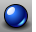
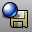

---
---

# Render Tools toolbar
{: #kanchor2366}
 [To open a toolbar](javascript:void(0);) Toolbars can be opened as a free-standing group or added to the current group.
To open a toolbar as a free-standing group
Click theOptionsicon in any toolbar group.On the menu, clickShow Toolbar, and then select the toolbar name from the list.To open a toolbar as a new tab in the current group
Click theOptionsicon in the toolbar group where you want to add the new tab.On the menu, clickShow or Hide Tabs, and then select the toolbar name from the list. [Animation Tools](animation.html#recordanimation) 
Link to [Animation Setup toolbar](animation-setup-toolbar.html) 
 [DirectionalLight](directionallight.html) 
Insert a light with parallel rays pointing in a direction.
 [Set material source to layer](material.html) 
Set material source to layer.
 [EditLightByHighlight](editlightbyhighlight.html) 
Add lights based on highlight locations.
 [EditLightByLooking](editlightbylooking.html) 
Set a spotlight direction using view manipulation tools.
 [EditLightByLooking, *NewSpotlight* ](editlightbylooking.html) 
Create new light by looking.
 [EnvironmentEditor](environmenteditor.html) 
Background color, image, projection.
 [GroundPlane](groundplane.html) 
Open the GroundPlane panel.
 [Libraries](libraries.html#libraries) 
Open the Libraries panel.
 [Light properties](light.html) 
Manage color, on/off, shadow intensity, spotlight hardness.
 [Lights](lights.html) 
Open the Lights panel.
 [LinearLight](linearlight.html) 
Insert a tubular light.
 [Match material properties](material.html) 
Change an object's material properties to match another object.
 [MappingWidget](texturemapping.html#mappingwidget) 
Turn on texture mapping widgets.
Link to [Texture Mapping toolbar](texture-mapping-toolbar.html) 
 [MappingWidgetOff](texturemapping.html#mappingwidgetoff) 
Turn off texture mapping widgets.
 [MaterialEditor](materialeditor.html) 
Open the Material Editor to manage materials in the model.
 [Mesh document properties](mesh.html) 
Manage the display/render mesh settings for the current model.
 [PackTextures](packtextures.html) 
Spread the texture over all of the faces of a polysurface.
Link to [Texture Tools toolbar](texture-tools-toolbar.html) 
 [PlayAnimation](animation.html#playanimation) 
Play back an animation or animation preview.
Link to: [Animation Preview toolbar](animation-preview-toolbar.html) 
 [PointLight](pointlight.html) 
Insert an omni-directional light.
 [RecordAnimation](animation.html#recordanimation) 
Render and save animation frames.
 [RectangularLight](rectangularlight.html) 
Insert a rectangular directional light.
 [Render](render.html) 
Render the objects using the current renderer.
 [Render settings (Document Properties)](rhino-render.html) 
Manage the render settings for the current model.
 [RenderPreview](render.html#renderpreview) 
Render the view in the render window with a with a rough quality for a fast preview.
 [Render settings (document properties)](rhino-render.html) 
Manage the render settings for the current model.
 [Render mesh settings](mesh.html) 
Manage the mesh settings for the current model.
 [SaveRenderWindowAs](render.html#saverenderwindowas) 
Save the image in the render window to a file.
 [Set render color](material.html#color) 
Sets the render color for an object.
 [Set render gloss color](material.html#gloss-finish) 
Sets the gloss color for the render material.
 [SetSpotlightToView](setspotlighttoview.html) 
Match spotlight direction to the viewport camera direction.
 [SetSpotlightToView, *NewSpotlight* ](setspotlighttoview.html) 
Add a spotlight from current view.
 [SetViewToSpotlight](setviewtospotlight.html) 
Match the view to a spotlight direction.
 [Spotlight](spotlight.html) 
Insert a light cone object.
 [Sun](sun.html) 
Open the Sun panel.
 [SynchronizeRenderColors](synchronizerendercolors.html) 
Change an object's material color to match its object or layer display color.
 [TexturePalette](texturepalette.html) 
Open the Texture Editor.
&#160;
&#160;
Rhinoceros 6 © 2010-2015 Robert McNeel &amp; Associates.11-Nov-2015
 [Open topic with navigation](render-tools-toolbar.html) 

