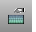
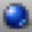

---
---

{: #kanchor347}{: #kanchor348}{: #kanchor349}{: #kanchor350}{: #kanchor351}{: #kanchor352}{: #kanchor353}{: #kanchor354}{: #kanchor355}{: #kanchor356}{: #kanchor357}{: #kanchor358}{: #kanchor359}{: #kanchor360}{: #kanchor361}
# Render
 [Where can I find this command?](javascript:void(0);) Toolbars
 [Render Tools](render-tools-toolbar.html)  [Standard](standard-toolbar.html) 
Menus
Render
Render
The Render command renders the model using the current renderer producing a color image in a separate display window.
To set the current renderer
On the Render menu, click Current Renderer.Choose the renderer from the list.Note
The materials assigned from the [Material Editor](materialeditor.html) to either with the [Properties](properties.html) command or the [Layers](layer.html#material) determine the colors of the rendered objects.If the objects you are rendering are very complex, Rhino may be slow to shade or render them the first time. It is during that time that Rhino calculates from the smooth geometry a hidden mesh that is used for the rendering. The next time you render the same model, the performance will have improved.
# Rendering basics
In addition to shaded previews, Rhino provides full-color rendering with lights, transparency, shadows, textures, and bump mapping.
Objects will render white until you add render color, highlight, texture, transparency, and bumps. These attributes are controlled through the Properties panel, [Material](material.html) page.

The process needed to render scenes consists of four basic steps:
Add lightingAssign materialsSet up the environment and ground planeRenderAlthough the steps do not have to be done in this order, using this method seems to make setting up a scene more efficient. To improve quality, repeat these steps until the image looks right to you.

## Lights
{: #kanchor362}
In every Rhino rendering there are light sources that Rhino uses to calculate how the objects are to be illuminated.&#160;If you do not add any light sources to your scene, the default light is used. The default light is a directional light with parallel rays that acts as though you have a lamp shining over your left shoulder.

Add indoor lightsorsun
Insert [Spotlights](spotlight.html), [Directional Lights](directionallight.html), [Linear Lights](linearlight.html), [Point Lights](pointlight.html), or [Rectangular Lights](rectangularlight.html) .Or turn on the [Sun](sun.html).
## Materials
{: #kanchor363}
Materials specify the color, finish, transparency, texture, and bump for use by the renderer.

Assign materials to layers
In the [Layers](layer.html) panel, select one or more layer names, and click in the Material column.In the Layer Material dialog box, select a material.Assign materials to objects
Select an object.In the Properties panel, [Material](material.html) page, select a material.Drag and drop materials onto objects
From the [Material Editor](materialeditor.html), click a material thumbnail and drag it onto an object.The object highlights when the cursor is over it.
## Environment
{: #kanchor364}
Environments describe the space around the model. This space is reflected in objects and can provide overall lighting.

Set up an environment
The rendering properties include environment settings like background color and image.
Open the [Environment Editor](environmenteditor.html) panel.Set up environment properties.
## Ground Plane
{: #kanchor365}
The ground plane provides an infinite horizontal platform for the image that stretches to the horizon in all directions positioned at a defined elevation. A ground plane renders much faster than using a surface as a background. Any material can be assigned to the ground plane.

Set up a ground plane
Open the [Ground Plane](groundplane.html) panel.Set up ground plane properties.
## Render
Render and save an image.
Render and save the image
On the Render menu, click Render.In the Render Window, on the File menu, click Save As.
## Missing Textures
If there are textures referred to in the model that are not on your system, a dialog box provides a list of the missing textures.
This setting must be enabled by checking the [Check for missing textures when rendering](rendering.html#check-for-missing-textures-when-rendering) box in [Rendering Options](rendering.html).
Copy All
Saves the list of missing textures to the Clipboard.
Save As
Saves the list of missing textures to a text file.
Continue
Continue to render without the missing textures.
Abort
Stop the rendering in order to locate the texture files.
Show usage of this resource
Click one of the resources in the list to display usage information.
Don't show me this again
Turns off the dialog display.
To turn the message back on
Check the [Check for missing textures when rendering](rendering.html#check-for-missing-textures-when-rendering) box in [Rendering Options](rendering.html) .Missing textures: usage information
Shows where the resource is being used.
Browse for replacement
Allows browsing for a different file or folder location.

## Rhino Image File Format (.rimage)
Rhino Render can save .rimage files. This is a proprietary file format that stores all of the information rendered by the rendering engine, including color, alpha, depth, normal channels, all with 32-bit per-channel resolution.{: #kanchor366}{: #kanchor367}
This information is used by the render window to execute the post-effects and exposure operators, and can also be used by custom controls implemented by a third-party renderer to achieve other effects.
Immediately after render time, the .rimage format can be used to store the data so that post-processing and exposure adjustments or format changes (saving in a different format without loss of information) can be done later.
The .rimage format is only supported by the Rhino render window. It cannot be loaded into any other software. It is a high-dynamic range format that supports lossless information transfer to .HDR and .EXR formats. It is uncompressed and the files can be huge.
To open an .rimage file
In the Rhino render window, on the File menu, click Open.OrUse the [RenderOpenRenderImage](#renderopenrenderimage) command to open an .rimage file without having a render window open.Completed renderings are saved in the .rimage format to a temporary location on your hard disk. Once one of the renderings is re-opened, all post effects and exposure settings are available as if the rendering were just completed.
To open the most recent .rimage file
In the Rhino render window, on the File menu, click Recent, and then choose a file.The files are named the by date and time of the rendering.For more information about post processing the rendered image, see: [Post-processing rendered images](renderwindowpostprocess.html).

# Render command-line/scripting commands

## CloseRenderWindow
{: #kanchor368}
{: #closerenderwindow}
{: #kanchor369}{: #kanchor370}{: #kanchor371}{: #kanchor372}
 [Where can I find this command?](javascript:void(0);) Toolbars
 [Not on toolbars.](toolbarwhattodo.html) 
Menus
 [Not on menus.](menuwhattodo.html) 
The CloseRenderWindow command closes the render display window.
This is useful for doing multiple renderings. When combined with the [SaveRenderWindowAs](#saverenderwindowas) command, you can create multiple renderings and save them to different files from your script.

## CopyRenderWindowToClipboard
{: #kanchor373}
{: #copyrenderwindowtoclipboard}
 [Where can I find this command?](javascript:void(0);) Toolbars
 [Not on toolbars.](toolbarwhattodo.html) 
Menus
 [Not on menus.](menuwhattodo.html) 
The CopyRenderWindowToClipboard command copies the image in the render window to the Clipboard.

## RenderInWindow
{: #kanchor374}
{: #renderinwindow}
 [Where can I find this command?](javascript:void(0);) Toolbars
 [Not on toolbars.](toolbarwhattodo.html) 
Menus
 [Not on toolbars.](toolbarwhattodo.html) 
The RenderInWindow command renders a selected area of the current viewport in the render window at viewport resolution.
The render uses the settings in [Mesh Document Properties](mesh.html).
## RenderOpenLastRendering
{: #kanchor375}
{: #renderopenlastrendering}
 [Where can I find this command?](javascript:void(0);) Toolbars
 [Not on toolbars.](toolbarwhattodo.html) 
Menus
Render
Open Last Rendering
The RenderOpenLastRendering command opens the last rendering image file (.rimage).

## RenderOpenRenderImage
{: #kanchor376}
{: #renderopenrenderimage}
 [Where can I find this command?](javascript:void(0);) Toolbars
 [Not on toolbars.](toolbarwhattodo.html) 
Menus
 [Not on menus.](menuwhattodo.html) 
The RenderOpenRenderImage command opens a browser window with the recent rendering image files (.rimage).

## RenderPreview
{: #kanchor377}
{: #renderpreview}
 [Where can I find this command?](javascript:void(0);) Toolbars
 [Render](render-tools-toolbar.html) 
Menus
Render
Render Preview
The RenderPreview command renders the current viewport in the render window at render resolution, optimizing render time.
The render uses the settings in [Mesh Document Properties](mesh.html).
## RenderPreviewInWindow
{: #kanchor378}
{: #renderpreviewinwindow}
 [Where can I find this command?](javascript:void(0);) Toolbars
 [Not on toolbars.](toolbarwhattodo.html) 
Menus
 [Not on toolbars.](toolbarwhattodo.html) 
The RenderPreviewInWindow command renders a selected area of the current viewport in the render window at render resolution, optimizing render time.
The render uses the settings in [Mesh Document Properties](mesh.html).
## RenderPreviewWindow
{: #kanchor379}
{: #renderpreviewwindow}
 [Where can I find this command?](javascript:void(0);) Toolbars
 [Not on toolbars.](toolbarwhattodo.html) 
Menus
 [Not on menus.](menuwhattodo.html) 
The RenderPreviewWindow command renders a selected area of the current viewport in the viewport at viewport resolution, optimizing render time.
The render uses the settings in [Mesh Document Properties](mesh.html).
## RenderReportMissingImageFiles
{: #kanchor380}
{: #renderreportmissingimagefiles}
 [Where can I find this command?](javascript:void(0);) Toolbars
 [Not on toolbars.](toolbarwhattodo.html) 
Menus
 [Not on menus.](menuwhattodo.html) 
The RenderReportMissingImageFiles command opens the image manager, which can be switched to show all image files in addition to missing ones.

## RenderSettings
{: #kanchor381}
{: #rendersettings}
 [Where can I find this command?](javascript:void(0);) Toolbars
 [Not on toolbars.](toolbarwhattodo.html) 
Menus
 [Not on menus.](menuwhattodo.html) 
The RenderSettings command opens the Render panel.

## RenderWindow
{: #kanchor382}
{: #renderwindow}
 [Where can I find this command?](javascript:void(0);) Toolbars
 [Not on toolbars.](toolbarwhattodo.html) 
Menus
 [Not on menus.](menuwhattodo.html) 
The RenderWindow command renders a selected area of the current viewport in the viewport at viewport resolution.
The render uses the settings in [Mesh Document Properties](mesh.html).
## SaveRenderWindowAs
{: #kanchor383}
{: #saverenderwindowas}
{: #kanchor384}{: #kanchor385}{: #kanchor386}{: #kanchor387} [Where can I find this command?](javascript:void(0);) Toolbars
 [Rende](render-tools-toolbar.html)  [r Tools](render-tools-toolbar.html) 
Menus
 [Not on menus.](menuwhattodo.html) 
The SaveRenderWindowAs command saves the image in the render window to a file.
Steps
In theSave Bitmapdialog box, choose the name, location, and file type for the bitmap file.You can save the bitmap in .bmp, .tga, .jpg, .pcx, .png, and .tif formats.In a script, you can follow the command with the name of the file to save to:SaveRenderWindowAs "C:/My Images/Rendering Two.bmp".Save As options
Save alpha channel
Saves an alpha channel if the file type supports transparency.

## SetCurrentRenderPlugIn
{: #kanchor388}
{: #setcurrentrenderplugin}
 [Where can I find this command?](javascript:void(0);) Toolbars
 [Not on toolbars.](toolbarwhattodo.html) 
Menus
Render
Current Render
The SetCurrentRenderPlugIn command specifies the current rendering plug-in application.
You can download plug-ins from [www.rhino3d.com/plug-ins](http://www.rhino3d.com/plug-ins).
See also
 [Render your model scene](sak-render.html) 
 [Add lights for rendering](sak-lights.html) 
 [Use materials and textures](sak-materialsandtextures.html) 
 [Use the Clipboard](sak-clipboardactions.html) 
&#160;
&#160;
Rhinoceros 6 © 2010-2015 Robert McNeel &amp; Associates.11-Nov-2015
 [Open topic with navigation](render.html) 

