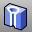

---
---

{: #kanchor1881}
# RevolvedHole
 [Where can I find this command?](javascript:void(0);) Toolbars
 [Holes](holes-toolbar.html)  [Solid Tools](solid-tools-toolbar.html) 
Menus
Solid
Solid Edit Tools
Holes
Revolved Hole
The RevolvedHole command creates holes in a polysurface by revolving a profile curve that defines the surface shape around an axis and subtracting the hole volume from the polysurface.
Steps
 [Select](select-objects.html) the hole profile curve. [Pick](pick-location.html) the curve base point.The base point determines the point on the curve that will intersect with the surface and depth of the hole.Select a target face.Infinite Plane: TypeIPfor [InfinitePlane](infiniteplane.html) options.
Pick the location for the hole center.The revolve axis is determined by the start and end of the profile curve.Your browser does not support the video tag.Options
Flip
Reverses the [direction](dir.html#normaldirection).
Undo
The Undo option reverses the last action.
See also
 [Create and edit holes in surfaces](sak-holes.html) 
&#160;
&#160;
Rhinoceros 6 © 2010-2015 Robert McNeel &amp; Associates.11-Nov-2015
 [Open topic with navigation](revolvedhole.html) 

