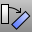
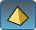

---
---

# Rotate
{: #kanchor1887}
{: #kanchor1886}
 [Where can I find this command?](javascript:void(0);) Toolbars
 [Main2](main2-toolbar.html)  [Transform](transform-toolbar.html) 
Menus
Transform
Rotate
The Rotate command rotates objects around an axis perpendicular to the current construction plane.
Steps
 [Select](select-objects.html) the objects. [Pick](pick-location.html) the center of rotation.Type the angle, or pick two reference points.Your browser does not support the video tag.Command-line options
UseLastCenter
The UseLastCenter option uses the previously selected center point for the rotation.
The rotation plane is based on a picked point and the construction plane of the active viewport.
Copy
 [&#160;History enabled](historyenabled.html) 
The Copy option specifies whether or not the objects are copied. A plus signappears at the cursor when copy mode is on.
The [RememberCopyOptions](remembercopyoptions.html) command determines whether the selected option is used as the default.
See also
 [Gumball](gumball.html) 
Displays the gumball widget on a selected object facilitating move, scale, and rotate transformations around the gumball origin.
 [Transform objects](sak-transform.html) 
&#160;
&#160;
Rhinoceros 6 © 2010-2015 Robert McNeel &amp; Associates.11-Nov-2015
 [Open topic with navigation](rotate.html) 

