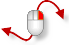
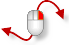

---
---

{: #kanchor1892}{: #kanchor1893}{: #kanchor1894}{: #kanchor1895}
# RotateView
 [Where can I find this command?](javascript:void(0);) Toolbars
 [Set View](set-view-toolbar.html)  [Standard](standard-toolbar.html)  [View](view-toolbar.html) 
Menus
View
Rotate
Viewport Title
Zoom, Pan, and Rotate
Rotate View
The RotateView command rotates the view camera around the target.
Your browser does not support the video tag.Steps
 [Specify a command line option.](specifycommandlineoption.html) Command-line options
Down
Rotate the view camera down.
Left
Rotate the view camera left.
Right
Rotate the view camera right.
Up
Rotate the view camera up.

### Perspective view mouse navigation
To navigate with a mouse in perspective views
Drag with the [right mouse button](mouse-buttons.html).

Views that are not looking perpendicular to the construction plane rotate with the [right mouse button](mouse-buttons.html).
To constrain to horizontal or vertical
 [Shift](shift-key.html) +drag with the [right mouse button](mouse-buttons.html).
 [Shift](shift-key.html) +

### Parallel view mouse navigation
To navigate with a mouse in parallel views
 [Ctrl](ctrl-key.html) + [Shift](shift-key.html) +drag with the [right mouse button](mouse-buttons.html).
 [Ctrl](ctrl-key.html) + [Shift](shift-key.html) +
To constrain to horizontal or vertical
Release [Shift](shift-key.html) or [Ctrl](ctrl-key.html) while rotating, and then press [Shift](shift-key.html) again to lock the direction.See also
 [View options](view.html) 
Manage pan, zoom, named views rotate, dynamic redraw, viewport linking, single-click maximize, default lens length options.
 [Navigate in the viewports](sak-navigate.html) 
&#160;
&#160;
Rhinoceros 6 © 2010-2015 Robert McNeel &amp; Associates.11-Nov-2015
 [Open topic with navigation](rotateview.html) 

