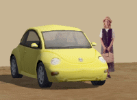

---
---

{: #kanchor1897}{: #kanchor1898}
# RPC
 [Where can I find this command?](javascript:void(0);) Toolbars
 [Not on toolbars.](toolbarwhattodo.html) 
Menus
 [Not on menus.](menuwhattodo.html) 
Rich Photo-realistic Content (RPC) describes the software and content associated with ArchVision's image-based rendering (IBR) technology, a method of incorporating photo image data into 3-D computer graphics environments.
RPC images have photographic detail and display the correct side of the image as the camera moves around it.

Steps
 [Pick a location](pick-location.html) .Pick a rotation angle.A mesh representation of the object is inserted into the model.Use [RPC Properties](#rpc-properties) to set up properties for the object.Options
Options depend on the type of RPC inserted.
See: [www.archvision.com](http://www.archvision.com) for more information.
RPC Properties{: #rpc-properties}
 [Where can I find this command?](javascript:void(0);) Toolbars
 [Popup](popup-toolbar.html)  [Properties](properties-toolbar.html)  [Standard](standard-toolbar.html) 
Menus
Edit and Panels
Object Properties
Manages Rich Photo-realistic Content (RPC) properties for the selected RPC objects.
Rich Photo-realistic Content (RPC) describes the software and content associated with ArchVision's image-based rendering (IBR) technology, a method of incorporating photo image data into 3-D computer graphics environments.
RPC images have photographic detail and display the correct side of the image as the camera moves around it.
Insert images with the [RPC](#) command.
Options
Options depend on the type of RPC inserted.
See: [www.archvision.com](http://www.archvision.com) for more information.

# RPCSetAnimationFrame
{: #rpcsetanimationframe}
 [Where can I find this command?](javascript:void(0);) Toolbars
 [Not on toolbars.](toolbarwhattodo.html) 
Menus
 [Not on menus.](menuwhattodo.html) 
The RPCSetAnimationFrame command sets the animation frame number for an RPC at the command line.
RPCs have a frame number for animations. This is so that walking people / moving people animations will work.
See also
 [Render](render.html) 
Render the objects using the current renderer.
 [Animate views](sak-animation.html) 
&#160;
&#160;
Rhinoceros 6 © 2010-2015 Robert McNeel &amp; Associates.11-Nov-2015
 [Open topic with navigation](rpc.html) 

