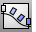
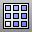
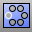

---
---

# Array objects
Array commands copy objects in specified directions and at a specified distance or angle. Objects can also be arrayed along curves or surfaces.

## Array objects in space
 [Array](array.html) 
Copy and space objects in columns, rows, and levels.
 [ArrayLinear](arraylinear.html) 
Copy and space objects in a single direction.
 [ArrayPolar](arraypolar.html) 
Copy and space objects around a central location.

## Array objects along a curve or surface
 [ArrayCrv](arraycrv.html) 
Copy and space objects along a curve.
 [ArrayCrvOnSrf](arraycrvonsrf.html) 
Copy and space objects along a curve on a surface.
 [ArraySrf](arraysrf.html) 
Copy and space objects in rows and columns on a surface.

## Array holes in a surface
 [ArrayHole](arrayhole.html) 
Copy and space holes in rows and columns.
 [ArrayHolePolar](arrayholepolar.html) 
Copy and space holes around a central location.
&#160;
&#160;
Rhinoceros 6 © 2010-2015 Robert McNeel &amp; Associates.11-Nov-2015
 [Open topic with navigation](sak-array.html) 

