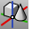

---
---

# Work with blocks, groups, and worksessions
Blocks, groups and worksessions are methods for organizing model elements.

## Work with blocks
Blocks are named groups of objects that act as a single object in your model. Blocks are useful for repeated objects such as symbols or components. Blocks save you time since you can reuse the components instead of re-drawing them each time. An advantage of using blocks for repeated content is that using blocks requires less memory. In addition, you can redefine a block and all of the instances placed in the model will update.
 [Block](block.html) 
Define a block object.
 [BlockEdit](blockedit.html) 
Allow selecting a block instance to change the block geometry and update the block definition.
 [BlockManager](blockmanager.html) 
Manage the block definitions.
 [ExplodeBlock](explode.html#explodeblock) 
Explode a block including any nested blocks into component objects.
 [Export](export.html) 
Save selected objects to a new file.
 [ExportWithOrigin](export.html#exportwithorigin) 
Save objects to a new file with a specified origin and construction plane.
 [Insert](insert.html) 
Insert block objects stored in the file or import a file as a block definition.
 [ModelBasepoint](modelbasepoint.html) 
Set a world origin that is used when inserting the model into another.
 [ReplaceBlock](replaceblock.html) 
Replace block instances with a different block definition.

## Work with groups
Grouping objects allows selecting multiple objects by picking one of the group components. Groups can be nested and named.
 [Group](group.html) 
Organize objects into a single component.
 [AddToGroup](group.html#addtogroup) 
Add an object to a selected group.
 [RemoveFromGroup](group.html#removefromgroup) 
Detach objects from their parent group.
 [Ungroup](group.html#ungroup) 
Remove the group status from objects.
 [SetGroupName](group.html#setgroupname) 
Name a group.

## Use worksessions
Worksessions allow multiple users to access the same models to use as reference geometry. A worksession is a list of models that can be viewed, snapped to, copied from and otherwise used as a reference for working on the active model.
 [Worksession](worksession.html) 
Manage a list of models that can be used as reference geometry.
See also
 [Use layers](sak-layer.html) 
&#160;
&#160;
Rhinoceros 6 © 2010-2015 Robert McNeel &amp; Associates.11-Nov-2015
 [Open topic with navigation](sak-blocksgroups.html) 

