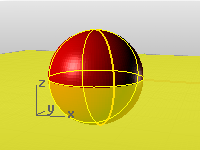
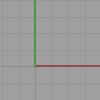

---
---

# Use construction planes
A construction plane is like a tabletop that the cursor normally moves on. The construction plane has an origin, x and y&#160;axes, and a grid. The construction plane can be set to any orientation, and each viewport’s construction plane is independent of those in other viewports.

The construction plane represents the local coordinate system for the viewport and can be different from the [world coordinate system](unit-systems.html#world-coordinates).
Rhino’s standard [viewports](rhino-window.html#appwindow-viewports) come with construction planes that correspond to the viewport. The default Perspective viewport, however, uses the world Top construction plane, which is the same construction plane that is used in the Top viewport.
The construction plane [grid](grid.html) lies on the construction plane. The dark red line represents the construction plane x&#160;axis. The dark green line represents the construction plane y&#160;axis. The red and green lines meet at the construction plane origin. The color of these lines can be changed.
To change the direction and origin of a construction plane, from the menu, use the [CPlane](cplane.html) command. Preset construction planes: World Top, Right, and Front give you quick access to common construction planes. In addition, you can save and restore [named construction planes](namedcplane.html) and import named construction planes from another Rhino file.
 [Coordinate input](unit-systems.html#coordinate-entry), [elevator mode](cursor-constraints.html#elevator-mode), [object snaps](object-snaps.html), and other [cursor constraints](cursor-constraints.html) allow the cursor to move away from the construction plane.
Notes
Construction plane behavior in the viewports is controlled by the [Standard](modeling-aids.html#standard-cplane) and [Universal](modeling-aids.html#universal-cplane) options. With the [Standard](modeling-aids.html#standard-cplane) option, the construction plane of each viewport is independent from all of the other constructions planes. With the [Universal](modeling-aids.html#universal-cplane) option, the behavior of the construction planes in the viewports is linked. Set these in [Modeling Aids Options](modeling-aids.html) .The construction plane is infinite. The array of lines lying on a specified portion of the construction plane in the viewport is the [grid](grid.html). The grid is a visual reference only. The [size, spacing](grid.html), and [color](appearance.html) of the grid lines can be changed.The x and y&#160;axes of the construction plane are shown on the [grid](grid.html) in color by default. The [visibility](grid.html#grid-axes-visibility) and [color](appearance.html) of the grid axes can be changed.Custom construction planes can be named and saved in the 3dm document, They can be restored in any viewport using the [NamedCPlane](namedcplane.html) command.
## Construction plane commands
 [CPlane](cplane.html) 
Set the construction plane in the active viewport.
 [CopyCPlaneSettingsToAll](cplane.html#copycplanesettingstoall) 
Match all viewports' grid and snap settings to the specified viewport.
 [CopyCPlaneToAll](cplane.html#copycplanetoall) 
Match all viewports' construction planes to the specified viewport.
 [MPlane](mplane.html) 
Set up a relationship between a construction plane and an object.
 [NamedCPlane](namedcplane.html) 
Manage the named construction planes list.
 [Universal construction plane](modeling-aids.html#universal-cplane) 
Link the viewport origin and position.
&#160;
&#160;
Rhinoceros 6 © 2010-2015 Robert McNeel &amp; Associates.11-Nov-2015
 [Open topic with navigation](sak-cplanes.html) 

