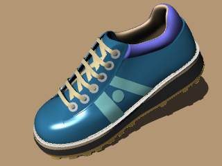
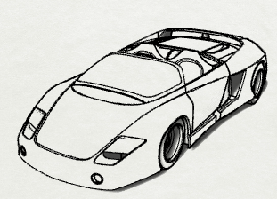

---
---

{: #kanchor2271}{: #kanchor2272}{: #kanchor2273}{: #kanchor2274}{: #kanchor2275}{: #kanchor2276}{: #kanchor2277}{: #kanchor2278}{: #kanchor2279}{: #kanchor2280}{: #kanchor2281}{: #kanchor2282}{: #kanchor2283}{: #kanchor2284}{: #kanchor2285}{: #kanchor2286}{: #kanchor2287}{: #kanchor2288}
# Viewport display modes
View your model in a variety of ways that depend on your own needs.
Standard and customized shaded modes allow easier visualization of surfaces and solids.

## Wireframe
{: #wireframe}
InWireframemode, surfaces look like a set of crossing curves. These curves are called [isoparametric curves](isocurve.html) or isocurves.Wireframemode usually offers the fastest display speed, shaded modes offer the ability to view surfaces and solids with shading to help you visualize the shapes. Isocurves do not define the surface the way the polygons do in a polygon mesh. They are merely a visual aid.

Wireframe display mode.

## Shaded
{: #shaded}
The shaded modes, for example,Shaded,Rendered,Artistic, andPen, display surfaces and solids with the surfaces shaded using their layer, object, or custom color. You can work in any of the shaded modes. The surfaces are opaque or transparent.

Shaded display mode.

## Rendered
{: #rendered}
InRenderedmode the objects are displayed with [lighting](sak-lights.html) and [render materials](sak-materialsandtextures.html), [ground plane](groundplane.html), and shadows applied.
Note: In order to display [bump mapping](materialeditor.html#bump) inRenderedmode, the [Use Advanced GPU lighting setting](view-displaymode-options.html) must be checked.

Rendered display mode.

## Ghosted
{: #ghosted}
TheGhostedmode sets viewport display so surfaces are translucent.

Ghosted display mode.

## X-Ray
{: #x-ray}
TheX-Raymode shades with [isoparametric curves](isocurve.html) not obscured by objects in front.
All wireframe and point objects are displayed, even if they would normally be hidden by surfaces that are in front of them in the viewport.

X-Ray display mode.

## Technical
{: #technical}
TheTechnicaldisplay mode uses real-time silhouettes and intersections, creases, borders, blended shaded and rendered display. Objects behind other objects are occluded.

Technical display mode.

## Artistic
{: #artistic}
TheArtisticdisplay mode uses an image background and soft lines to create a pencil drawing effect.

Artistic display mode.

## Pen
{: #pen}
ThePendisplay mode uses white with black lines to simulate a pen drawing.

Pen display mode.

## Set a viewport display mode
 [Artistic display mode](view-displaymode-options.html#artistic) 
Uses an image background and soft lines to create a pencil drawing effect.
 [FlatShade](flatshade.html) 
Shade objects without smoothing between mesh faces.
 [Ghosted viewport display mode](view-displaymode-options.html#ghosted) 
Shade objects so surfaces are translucent.
 [Pen display mode](view-displaymode-options.html#pen) 
Uses white with black lines to simulate a pen drawing.
 [Rendered viewport display mode](view-displaymode-options.html#rendered) 
Shade objects with a simulation of the rendered view.
 [Shaded viewport display mode](view-displaymode-options.html#shaded) 
Set the viewport to opaque shaded mode.
 [Technical display mode](view-displaymode-options.html#technical) 
Uses real-time silhouettes and intersections, creases, borders, blended shaded and rendered display. Objects behind other objects are occluded.
 [Wireframe viewport display mode](view-displaymode-options.html#wireframe) 
Set the viewport display to unshaded wireframe.
 [X-Ray viewport display mode](view-displaymode-options.html#x-ray) 
Shade with unobscured [isoparametric curves](isocurve.html).

## Shade the viewport temporarily
 [Shade](shade.html) 
Temporarily shade the current viewport.
 [ShadeSelected](shade.html#shadeselected) 
Shade selected objects only.

## Change or update the display mode
 [Advanced display properties](view-displaymode-options.html) 
Manage the appearance of the viewport display modes.
 [ClearAllMeshes](clearallmeshes.html) 
Delete render and analysis meshes.
 [Mesh document properties](mesh.html) 
Manage the display/render mesh settings for the current model.
 [RefreshShade](refreshshade.html) 
Regenerate an object's render mesh.

## View the render mesh for objects
 [ShowRenderMesh](showrendermesh.html) 
Display the render mesh for selected objects.
 [HideRenderMesh](showrendermesh.html#hiderendermesh) 
Hide the render mesh displayed with the [ShowRenderMesh](showrendermesh.html) command.
 [ToggleRenderMesh](showrendermesh.html#togglerendermesh) 
Toggle the display state of render meshes on an object.
&#160;
&#160;
Rhinoceros 6 © 2010-2015 Robert McNeel &amp; Associates.11-Nov-2015
 [Open topic with navigation](sak-displaymodes.html) 

