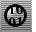
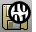

---
---

{: #kanchor2294}
# Work with files
In addition to saving and opening model .3dm files, Rhino can also open and save a large number of file formats created by other software.
For a list of supported file formats, see: [Index of import/export file types](-index-of-import-export-file-types.html).

## Open a model or create a new model
 [New](new.html) 
Create a new model based on a template.
 [Open](open.html) 
Open an existing model file.
 [Import](import.html) 
Merge objects from another model file.
 [Insert](insert.html) 
Insert block objects stored in the file or import a file as a block definition.

## Save or export a model
 [Autosave](autosave.html) 
Save the current model to a backup file.
 [IncrementalSave](save.html#incrementalsave) 
Save sequentially-numbered versions of a model.
 [Revert](revert.html) 
Discard changes and revert to the previously saved document.
 [Save](save.html) 
Save the current model.
 [SaveAs](save.html#saveas) 
Save the current model with a different name, close the current model, and open the new model.
 [SaveAsTemplate](save.html#saveastemplate) 
Save the current model as a template file.
 [SaveSmall](save.html#savesmall) 
Save geometry objects without render or analysis meshes.
 [Automatic back up](save.html) 
Automatically backup upon save.
 [Export](export.html) 
Save selected objects to a new file.
 [ExportWithOrigin](export.html#exportwithorigin) 
Save objects to a new file with a specified origin and construction plane.

## Use worksessions
 [Worksession](worksession.html) 
Manage a list of models that can be used as reference geometry.
 [PurgeRefObjects](worksession.html#purgerefobjects) 
Delete worksession reference objects.
 [LimitReferenceModel](worksession.html#limitreferencemodel) 
Limit the amount of reference geometry that is available to work on.

## Check files for errors
 [Audit](audit.html) 
Check the active file for errors.
 [Audit3dmFile](audit.html#audit3dmfile) 
Check any Rhino model file for errors.
 [Rescue3dmFile](rescue3dmfile.html) 
Recover data from damaged files.
See also
 [File Formats](-index-of-import-export-file-types.html) 
 [Start Rhino in safe mode](startingrhino.html#start-rhino-in-safe-mode) 
&#160;
&#160;
Rhinoceros 6 © 2010-2015 Robert McNeel &amp; Associates.11-Nov-2015
 [Open topic with navigation](sak-file.html) 

