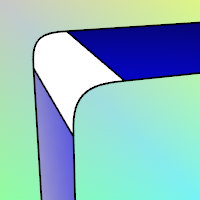
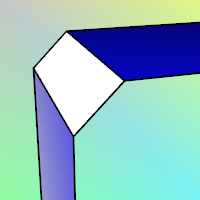

---
---

# Fillet, blend, or chamfer
Use these methods to create transitions between curves and surfaces.

## Fillet curves and surfaces
Fillets are arc-shaped transitions between curves on the same plane or between surfaces.

 [Fillet](fillet.html) 
Add an arc between two curves and trims or extends the curves to the arc.
 [FilletCorners](filletcorners.html) 
Round polyline corners with arcs.
 [FilletEdge](filletedge.html) 
Create a tangent surface between polysurface edges.
 [FilletSrf](filletsrf.html) 
Create a constant-radius round surface between two surfaces.
 [VariableFilletSrf](variablefilletsrf.html) 
Create a round tangent surface between two surface edges with varying radius values.

## Chamfer curves and surfaces
Chamfers are straight-line transitions between curves on the same plane or between surfaces.

 [Chamfer](chamfer.html) 
Create a line segment between two curves and trims or extends the curves to meet it.
 [ChamferEdge](chamferedge.html) 
Create a ruled surface at polysurface edges.
 [ChamferSrf](chamfersrf.html) 
Create a ruled surface between two surface edges.
 [VariableChamferSrf](variablechamfersrf.html) 
Create a chamfer surface between surface edges with varying distance values.

## Blend curves and surfaces
Blends are smooth transitions with [continuity](continuity-descriptions.html) matching between curves on the same plane or between surfaces.

Blend
Connect two curves maintaining continuity.
 [BlendCrv](blendcrv.html) 
Connect two curves with continuity control.
 [BlendEdge](blendedge.html) 
Create a surface between polysurface edges maintaining continuity.
 [BlendSrf](blendsrf.html) 
Create a blend surface between two surfaces with continuity control.
 [VariableBlendSrf](variableblendsrf.html) 
Create a blend surface between surface edges with varying radius values.
See also
 [Edit curves](sak-curvetools.html) 
 [Edit solid objects](sak-solidtools.html) 
 [Edit surfaces](sak-surfacetools.html) 
&#160;
&#160;
Rhinoceros 6 © 2010-2015 Robert McNeel &amp; Associates.11-Nov-2015
 [Open topic with navigation](sak-fillet-blend-chamfer.html) 

