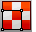

---
---

# Use materials and textures
A material defines the color, finish, transparency, texture, and bump for use by the Rhino renderer.
Note
Materials can be dragged and dropped onto [Material](materialeditor.html), [Texture](texturepalette.html), and [Environment](environmenteditor.html) controls.Colors and textures can be dragged from the color swatch and dropped onto any other color swatch or control in the Material Editor, [Texture Palette](texturepalette.html), or [Environment Editor](environmenteditor.html).
## Use materials
 [MaterialEditor](materialeditor.html) 
Open the Material Editor to manage materials in the model.
 [MaterialProperties](material.html) 
Assignment, color, bump, environment map, name, texture, transparency.

## Apply and map textures
 [TexturePalette](texturepalette.html) 
Open the Texture Editor.
 [Texture Mapping](texturemapping.html) 
Manage channel, mapping type display mapping widgets.
 [UVEditor](texturemapping.html#uveditor) 
Project the texture coordinates of the selected object to a specified region of space.
 [Unwrap](texturemapping.html#unwrap) 
Project surface mapping texture coordinates and the texture of an object onto the world xy&#160;plane.
 [Properties](properties.html) 
Object, material, texture mapping, decals.
 [MappingWidget](texturemapping.html#mappingwidget) 
Turn on texture mapping widgets.
 [ApplyBoxMapping](texturemapping.html#applyboxmapping) 
Add a box texture mapping channel to an object.
 [ApplyCustomMapping](texturemapping.html#applycustommapping) 
Add a custom texture mapping channel to an object.
 [ApplyCylindricalMapping](texturemapping.html#applycylindricalmapping) 
Add a cylindrical texture mapping channel to an object.
 [ApplyPlanarMapping](texturemapping.html#applyplanarmapping) 
Add a planar texture mapping channel.
 [ApplySphericalMapping](texturemapping.html#applysphericalmapping) 
Add a spherical texture mapping channel to an object.
 [ApplySurfaceMapping](texturemapping.html#applysurfacemapping) 
Add a surface texture mapping channel to an object.
 [MatchMapping](texturemapping.html#matchmapping) 
Change an object's texture mapping properties to match another object.
 [ClearAllMeshes](clearallmeshes.html) 
Delete render and analysis meshes.

## Apply special meshing
 [Curve Piping](curvepiping.html) 
 [Displacement](displacement.html) 
 [Edge Softening](edgesoftening.html) 
 [Shut Lining](shutlining.html) 
 [Thickness](thickness.html) 
&#160;
&#160;
Rhinoceros 6 © 2010-2015 Robert McNeel &amp; Associates.11-Nov-2015
 [Open topic with navigation](sak-materialsandtextures.html) 

