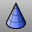
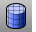
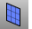
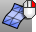

---
---

# Mesh objects
Draw mesh objects or create meshes from [NURBS](http://www.rhino3d.com/nurbs) objects.
Because there are many modelers that use polygon meshes to represent geometry for rendering, animation, stereolithography, visualization, and finite element analysis, the [Mesh](mesh.html) command translates [NURBS](http://www.rhino3d.com/nurbs) geometry into polygonal meshes for export. In addition, the Mesh creation commands [MeshSphere](meshsphere.html), [MeshBox](meshbox.html), [MeshCylinder](meshcylinder.html), etc., draw mesh objects.

There is no easy way to convert a mesh model into a [NURBS](http://www.rhino3d.com/nurbs) model. The information that defines the objects is completely different. However, Rhino has a few commands for drawing curves on meshes and extracting vertex points and other information from mesh objects to assist in using mesh information to create [NURBS](http://www.rhino3d.com/nurbs) models.

## Draw mesh objects
Draw mesh objects directly.
 [3DFace](3dface.html) 
Draw a single mesh face.
 [MeshBox](meshbox.html) 
Draw a mesh box.
 [MeshCone](meshcone.html) 
Draw a mesh cone.
 [MeshCylinder](meshcylinder.html) 
Draw a mesh cylinder.
 [MeshEllipsoid](meshellipsoid.html) 
Draw a mesh ellipsoid.
 [MeshFromLines](meshfromlines.html) 
Construct a mesh from lines.
 [MeshPlane](meshplane.html) 
Draw a rectangular mesh plane.
 [MeshPolyline](meshpolyline.html) 
Create a mesh from a closed polyline.
 [MeshSphere](meshsphere.html) 
Draw a mesh sphere.
 [MeshTorus](meshtorus.html) 
Draw a mesh torus.

## Create meshes from other objects
Generate meshes based on curves and surfaces.
 [ApplyMesh](applymesh.html) 
Fit a mesh that matches a source mesh onto a surface.
 [ApplyMeshUVN](applymeshuvn.html) 
Wrap meshes and points onto a surface.
 [Mesh](mesh.html) 
Create a mesh from a NURBS surface or polysurface.
 [MeshPatch](meshpatch.html) 
Create a mesh from curves and points.
 [MeshPolyline](meshpolyline.html) 
Create a mesh from a closed polyline.
 [PlanarMesh](planarmesh.html) 
Create a planar mesh from closed curves.
See also
 [MeshToNURB](meshtonurb.html) 
Duplicate each mesh face with a NURBS surface.
 [Collapse mesh faces and vertices](sak-collapsemesh.html) 
 [Edit mesh objects](sak-meshtools.html) 
 [White paper: Scan, Cleanup, Remodel](http://download.rhino3d.com/download.asp?id=ScanCleanupRemodel) 
&#160;
&#160;
Rhinoceros 6 © 2010-2015 Robert McNeel &amp; Associates.11-Nov-2015
 [Open topic with navigation](sak-mesh.html) 

