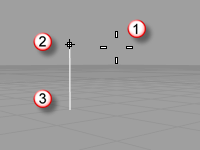
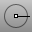

---
---

{: #kanchor2296}
# Use modeling aids
Cursor constraints and modeling aids assist in accurately locating objects in 3-D space.
The cursor can always move freely in space, but you will normally want to relate your modeling elements to the construction plane grid, existing objects, or coordinates in space.

## Cursor constraints
There are two parts of the cursor: thecursor (1)and themarker (2). The cursor always follow the mouse movement.
The marker sometimes leaves the center of the cursor because of some constraint on it such as grid snap or ortho. The marker is a dynamic preview of the point that will be picked when the left mouse button is clicked.
When the marker is constrained, in elevator mode, for example, atracking line (3)also displays.

Constraints move your marker to a specific point in space or make its movement track according to the constraint so you can model accurately.
 [Angle cursor constraint](cursor-constraints.html#angle) Restrict the angle the cursor can travel.
 [Distance cursor constraint](cursor-constraints.html#distance-constraint) Restrict the distance the cursor can travel.
 [Coordinate entry](unit-systems.html#coordinate-entry) Enter coordinates for cursor location.
 [Elevator mode (vertical cursor constraint](cursor-constraints.html#elevator-mode) Specify a point that is a given distance above or below a point on the construction plane.
 [Tab key cursor direction lock](cursor-constraints.html#directionlock) Lock the cursor direction with the Tab key.
 [Point filters](cursor-constraints.html#point-filters) Extract individual x, y, and z&#160;coordinate values to create a new, composite coordinate.
 [Ortho](ortho.html) 
Restrict cursor movement to an angle.
 [Planar](planar.html) 
Limit picking locations to an elevation.
 [Snap](snap.html) 
Toggle the current snap mode state.

## Modeling aids
 [CPlane](cplane.html) 
Set the construction plane in the active viewport.
 [DragMode](dragmode.html) 
Specify the plane object dragging will be parallel to.
 [Nudge](modeling-aids-nudge.html) 
Move objects a small increment using arrow keys.
 [Object snaps](object-snaps.html) 
Constrain the marker to an exact location on an object such as the center of a circle or the midpoint of a line.
 [SmartTrack](modeling-aids-smarttrack.html) 
Turn on a system of temporary reference lines and points.
See also
 [Measure objects](sak-measure.html) 
&#160;
&#160;
Rhinoceros 6 © 2010-2015 Robert McNeel &amp; Associates.11-Nov-2015
 [Open topic with navigation](sak-modelingaids.html) 

