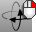
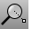
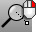
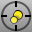
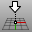
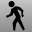

---
---

# Navigate in viewports
Navigation is accomplished using a camera and target metaphor. The camera and target can be visualized with the [Camera](camera.html) command.
The viewport title has some special functions for manipulating the viewport.
Click the title to make the viewport active without disturbing the view.Drag the viewport title to move the viewport.Double-click the viewport title to maximize the viewport. Double-click again to restore the size to normal.
## Viewport projection
Viewports can have one of three projections: parallel, perspective or two-point perspective.
Right mouse navigation works differently in the two viewport styles. In parallel views, right mouse dragging pans the view. In perspective views, right-mouse dragging rotates the view. In the usual four-viewport layout, there are three parallel viewports and one perspective viewport.
Parallel
Parallel views are also called orthogonal views in some systems. In a parallel view, all the grid lines are parallel to each other, and identical objects look the same size, regardless of where they are in space.

Parallel projection.
Perspective
In a perspective view, grid lines converge to a vanishing point. This provides the illusion of depth in the viewport. Perspective projection makes objects farther away look smaller.

Perspective projection.

## Viewport navigation
Rhino’s easy navigation helps you to visualize your model.
The simplest way to change the view is to drag the mouse with right button held down. This pans the view in parallel views and rotates the view in perspective views.
You can change your view in the middle of a command to see precisely where you want to select an object or choose a point.
 [Camera](camera.html) 
Show, hide, or toggle the visibility of the viewport camera.
 [UndoView](undoview.html) 
Undo the last view change.

## Pan and Rotate
 [Pan](pan.html) 
Shift the location of the view camera and target parallel to the view plane.
 [RotateCamera](rotatecamera.html) 
Rotate the view target around the camera.
 [RotateView](rotateview.html) 
Rotate the view camera around the target.
 [TiltView](tiltview.html) 
Rotate the view around the view axis.

## Zoom
 [DollyZoom](dollyzoom.html) 
Move the camera location and change the lens length at the same time.
 [Zoom](zoom.html) 
Move the viewport camera so the area defined by a window selection fills the viewport.
 [Zoom1To1Calibrate](zoom.html#zoom1to1calibrate) 
Calibrate the screen for the Zoom command, 1To1 option.
 [ZoomLens](zoom.html#zoomlens) 
Adjust the lens length of the viewport camera in a perspective view.
 [ZoomNaked](zoomnaked.html) 
Zooms to include all naked edges on selected objects with naked edges.
 [ZoomNonManifold](zoomnonmanifold.html) 
Zooms to include all non-manifold edges on selected objects with [non-manifold](non-manifold-edges.html) edges.

## Set a view
 [MoveTargetToObjects](movetargettoobjects.html) 
Move the target to the center of selected objects.
 [NamedView](namedview.html) 
Manage the named views.
 [OneView](oneview.html) 
Sets the active construction plane according to the current view direction to accommodate single-window modeling.
 [OrientCameraToSrf](orientcameratosrf.html) 
Align the view to a surface normal.
 [PerspectiveAngle](perspectiveangle.html) 
Set the viewport field-of-view angle.
 [PerspectiveMatch](perspectivematch.html) 
Allow matching the view to the Wallpaper image.
 [Plan](setview.html#plan) 
Set the viewport to a parallel plan view.
 [SetView](setview.html) 
Change the view to a standard construction plane view.
 [SetViewToSpotlight](setviewtospotlight.html) 
Match the view to a spotlight direction.
 [SwapView](swapview.html) 
Exchange the views in two viewports with one another.
See also
 [SynchronizeViews](synchronizeviews.html) 
Set the scale and center of all viewports to match the active viewport.
 [Turntable](turntable.html) 
Rotate a view around the target.
 [WalkAbout](walkabout.html) 
Toggle between WalkAbout and normal navigation modes.
&#160;
&#160;
Rhinoceros 6 © 2010-2015 Robert McNeel &amp; Associates.11-Nov-2015
 [Open topic with navigation](sak-navigate.html) 

