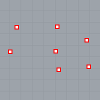
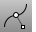
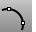

---
---

# Draw point objects
Point objects mark a single point in 3-D space. They are the simplest objects in Rhino. Points can be placed anywhere in space. Points are most often used as placeholders.

## Draw points
 [Point](point.html) 
Draw a single point object.
 [Points](points.html) 
Draw multiple point objects.
 [PointGrid](pointgrid.html) 
Draw a rectangular grid of point objects.

## Create points from objects
 [ClosestPt](closestpt.html) 
Create a point object on an object at the nearest location to a base location or to another object.
 [CrvStart](crvstart.html) 
Place a point object at the start of a curve.
 [CrvEnd](crvstart.html#crvend) 
Place a point object at the end of a curve.
 [CrvSeam](crvseam.html) 
Change the seam (start/end) location on closed curves.
 [Divide](divide.html) 
Create point objects along a curve by the number of equal length segments or segments of a specified length.
 [DrapePt](drapept.html) 
Create a grid of points at the intersections of objects and points projected toward the construction plane.
 [PointCloud](pointcloud.html) 
Create a set of vertices from point objects.
 [PointsFromUV](pointsfromuv.html) 
Create point objects at specified surface u and v&#160;coordinates.
See also
 [PointsOn](pointson.html) 
Display curve and surface control points.
 [EditPtOn](pointson.html#editpton) 
Display points on the curve evaluated at [knot](knot.html) averages.
 [SolidPtOn](pointson.html#solidpton) 
Turn on pseudo control points for polysurfaces.
&#160;
&#160;
Rhinoceros 6 © 2010-2015 Robert McNeel &amp; Associates.11-Nov-2015
 [Open topic with navigation](sak-point.html) 

