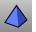
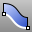

---
---

# Polysurfaces and extrusion objects
Apolysurfaceconsists of two or more surfaces that are joined together. A polysurface that encloses a volume of space defines a solid.

Solids are created anytime a surface or polysurface is completely closed.
Some Rhino commands create polysurface solids. [Pyramid](pyramid.html), [Cone](cone.html), and [TruncatedCone](truncatedcone.html) are examples of commands that create polysurface solids.

## Lightweight extrusion objects
The [Box](box.html), [Cylinder](cylinder.html), [Tube](tube.html), [ExtrudeCrv](extrudecrv.html), and [ExtrudeSrf](extrudesrf.html) commands can create polysurface or [extrusion](sak-extrude.html) objects. Polysurfaces can be closed with a planar cap or open.
Note
In models containing large numbers of polysurfaces, performance can be sluggish due to the relatively high demand on resources. If the same objects are made in Rhino as lightweight extrusion objects, these models are more responsive and more memory is available.The [UseExtrusions](useextrusions.html) command controls the use of lightweight extrusion objects. To make commands that normally create extrusions create traditional polysurfaces, select thePolysurfaceoption.Commands affected
 [UseExtrusions](useextrusions.html) 
Specifies whether extrusion objects or polysurfaces are used when extruding straight&#8209;side objects.
The [UseExtrusions](useextrusions.html) command controls the use of extrusion objects.
When [UseExtrusions](useextrusions.html) is turned on, Rhino commands that create simple solids and surfaces will use extrusion objects when possible.When [UseExtrusions](useextrusions.html) is turned off, these commands will create surface and polysurface objects.Turning off [UseExtrusions](useextrusions.html) does not change existing extrusion objects. [ConvertExtrusion](convertextrusion.html) 
Convert extrusion objects to surfaces and polysurfaces.
 [SelPolysrf](selection-commands.html#selpolysrf) 
Select all polysurfaces.
 [SelClosedPolysrf](selection-commands.html#selclosedpolysrf) 
Select all closed polysurfaces.
 [SelOpenPolysrf](selection-commands.html#selopenpolysrf) 
Select all open polysurfaces.
 [Explode](explode.html) 
Break objects down into components.
 [ConvertExtrusion](convertextrusion.html) 
Convert extrusion objects to surfaces and polysurfaces.

## Draw polysurfaces
When [UseExtrusions](useextrusions.html) is turned off, these commands will create surface and polysurface objects.
 [Boss](boss.html) 
Extrude closed planar curves normal to the curve plane toward a boundary surface where the boundary surface is trimmed and joined to the extruded objects.
 [Box](box.html) 
Draws a solid box.
 [Cone](cone.html) 
Draw a cone.
 [Cylinder](cylinder.html) 
Draw a cylinder.
 [Fin](fin.html) 
Extrude a curve on a surface in the surface normal direction.
 [Pipe](pipe.html) 
Create a [surface](rhinoobjects.html#surfaces), [polysurface](rhinoobjects.html#polysurfaces), or [extrusion](rhinoobjects.html#lightweightextrusions) object with a circular profile around a curve.
 [Pyramid](pyramid.html) 
Draw a pyramid.
 [Rib](rib.html) 
Extrude a curve in two directions to a boundary surface.
 [Ribbon](ribbon.html) 
Offset a curve and create a ruled surface between the curves.
 [Slab](slab.html) 
Offset a polyline, and extrude and cap the result to create a solid.
 [TruncatedCone](truncatedcone.html) 
Draw a cone whose apex is truncated by a plane.
 [TruncatedPyramid](truncatedpyramid.html) 
Draw a pyramid whose apex is truncated by a plane.

## Extrude curves into polysurfaces
When [UseExtrusions](useextrusions.html) is turned off, these commands will create surface and polysurface objects.
 [ExtrudeCrv](extrudecrv.html) 
Drive closed planar curves in a straight line.
 [ExtrudeCrvAlongCrv](extrudecrvalongcrv.html) 
Drive closed planar curves along a path curve.
 [ExtrudeCrvTapered](extrudecrvtapered.html) 
Drive closed planar curves in a straight line tapering at an angle.
 [ExtrudeCrvToPoint](extrudecrvtopoint.html) 
Drive closed planar curves tapering to a point.

## Extrude surfaces into polysurfaces
When [UseExtrusions](useextrusions.html) is turned off, these commands will create surface and polysurface objects.
 [ExtrudeSrf](extrudesrf.html) 
Drive surface edges in a straight line to create a solid.
 [ExtrudeSrfAlongCrv](extrudesrfalongcrv.html) 
Drive surface edges along a path curve to create a solid.
 [ExtrudeSrfTapered](extrudesrftapered.html) 
Drive surface edges in a straight line tapering at an angle to create a solid.
 [ExtrudeSrfToPoint](extrudesrftopoint.html) 
Drive surface edges tapering to a point to create a solid.
See also
 [Extrude curves and surfaces](sak-extrude.html) 
&#160;
&#160;
Rhinoceros 6 © 2010-2015 Robert McNeel &amp; Associates.11-Nov-2015
 [Open topic with navigation](sak-polysurfaces.html) 

