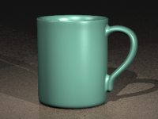
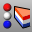

---
---

# Render your model scene
Render the model using the current renderer producing a color image in a separate display window.

## Rendering overview
The process needed to render scenes consists of four basic steps:
Add [lighting](lights.html) Assign [materials](materialeditor.html) Set up the [environment](environmenteditor.html) RenderAlthough the steps do not have to be done in this order, using this method seems to make setting up a scene more efficient. To improve quality, repeat these steps until the image looks right to you.

## Set up materials
Assign materials to layers
In the [Layers](layer.html) dialog box, select one or more layer names, and click in theMaterialcolumn.In theLayer Materialdialog box, set up [material properties](materialeditor.html) .Assign materials to objects
Select an object.On theEditmenu, click [Object Properties](properties.html) .In the [Properties](properties.html) panel, on the [Material](material.html) page, set up [material properties](materialeditor.html) .Set up lighting
Add [spotlights](spotlight.html) or other [lights](lights.html) .Set up the rendering environment
The rendering properties include environment settings like background color and image.
Open the [Environment Editor](environmenteditor.html) .Set up environment properties.Turn on a ground plane
Open the [Ground Plane](groundplane.html) panel.Set up ground plane properties.Render and save
On theRendermenu, clickRender.In theRender Window, on theFilemenu, clickSave As.
## Set up and preview rendering
 [Lights](lights.html) 
Open the Lights panel.
 [EnvironmentEditor](environmenteditor.html) 
Background color, image, projection.
 [MaterialProperties](material.html) 
Assignment, color, bump, environment map, name, texture, transparency.
 [SynchronizeRenderColors](synchronizerendercolors.html) 
Change an object's material color to match its object or layer display color.
 [Rendered viewport display mode](view-displaymode-options.html#rendered) 
Shade objects with a simulation of the rendered view.
 [RenderPreview](render.html#renderpreview) 
Render the view in the render window with a with a rough quality for a fast preview.
 [RenderPreviewWindow](render.html#renderpreviewwindow) 
Render a selected area in the viewport with a rough quality for a fast preview.
 [RenderInWindow](render.html#renderinwindow) 
Render a selected area in the render window at viewport resolution.
 [RenderPreviewInWindow](render.html#renderpreviewinwindow) 
Render a selected area in the render window with a rough quality for a fast preview.

## Manage libraries, previews, support, texture size.
 [ShowRenderMesh](showrendermesh.html) 
Display the render mesh for selected objects.
 [HideRenderMesh](showrendermesh.html#hiderendermesh) 
Hide the render mesh displayed with the [ShowRenderMesh](showrendermesh.html) command.
 [ContentFilter](contentfilter.html) 
Open the Content Filter dialog box.

## Render
 [Render](render.html) 
Render the objects using the current renderer.
 [RenderWindow](render.html#renderwindow) 
Render a selected area in the viewport at viewport resolution.
 [RenderInWindow](render.html#renderinwindow) 
Render a selected area in the render window at viewport resolution.
 [SetCurrentRenderPlugIn](render.html#setcurrentrenderplugin) 
Specify a rendering plug-in.
See also
 [Add lights for rendering](sak-lights.html) 
 [Animate views](sak-animation.html) 
 [Use materials and textures](sak-materialsandtextures.html) 
&#160;
&#160;
Rhinoceros 6 © 2010-2015 Robert McNeel &amp; Associates.11-Nov-2015
 [Open topic with navigation](sak-render.html) 

